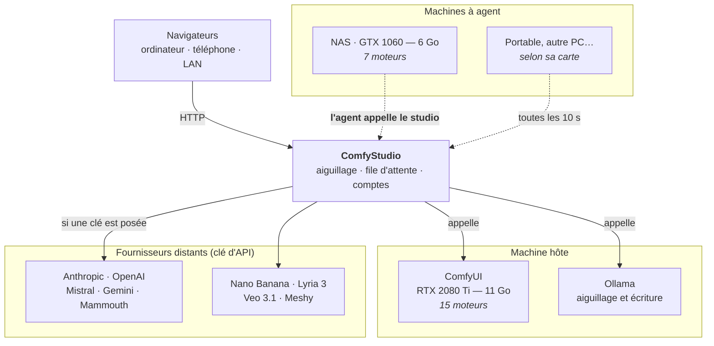

# ComfyStudio

> Interface en langage naturel pour ComfyUI — sous licence **AGPL-3.0**.
> Copyright © 2026 Hogun974.
>
> Vous pouvez l'utiliser, l'étudier, le modifier et le redistribuer. En
> revanche, toute version modifiée doit rester sous la même licence et rester
> accessible — **y compris si vous vous contentez de l'héberger en ligne**
> (article 13). Personne ne peut donc en faire un produit fermé.
> Texte complet : [LICENSE](LICENSE).

Interface en langage naturel pour ComfyUI. Tu écris ce que tu veux en français ;
un modèle local comprend l'intention, complète le prompt, pose une question si
la demande est trop vague, choisit le moteur adapté et règle ses paramètres.

**Portable** : rien n'est installé sur la machine. Tout tient dans ce dossier et
s'appuie sur le Python embarqué de ComfyUI. Déplace `D:\ComfyStudio` à côté de
`ComfyUI_windows_portable` et ça fonctionne.

**En un mot** : tu écris « un renard roux dans la neige au crépuscule » et le
studio choisit le moteur, écrit le prompt anglais s'il le faut, règle les
étapes, lance le calcul sur la machine la mieux placée, et te rend l'image.
Puis « agrandis-la », « détoure-la », « le même personnage sous la pluie ».

Il sait produire des **images**, les **retoucher**, les **agrandir**, les
**détourer**, des **vidéos** (et les fluidifier), de la **musique chantée**,
des **planches de BD** et des **objets 3D** — en local, sur plusieurs machines
à la fois, ou chez un fournisseur distant si l'on pose une clé d'API.


## Sommaire

- [Avant de commencer](#avant-de-commencer)
- [Installer](#installer)
- [Démarrer](#démarrer)
- [Ce que tu peux demander](#ce-que-tu-peux-demander)
- [Architecture](#architecture)
- [Plusieurs utilisateurs](#plusieurs-utilisateurs)
- [Piloter ComfyUI depuis l'interface](#piloter-comfyui-depuis-linterface)
- [Choisir la résolution](#choisir-la-résolution)
- [Rapide ou soigné](#rapide-ou-soigné)
- [Des machines qui viennent d'elles-memes](#des-machines-qui-viennent-delles-memes)
- [Quand un réglage n'est pas suivi](#quand-un-réglage-nest-pas-suivi)
- [Quand une machine tombe](#quand-une-machine-tombe)
- [Deux studios sur la même machine](#deux-studios-sur-la-même-machine)
- [Déplacer le studio sur une machine sans carte](#déplacer-le-studio-sur-une-machine-sans-carte)
- [Plusieurs machines, de puissances différentes](#plusieurs-machines-de-puissances-différentes)
- [Retrouver ce qu'on a produit](#retrouver-ce-quon-a-produit)
- [Fermer une conversation](#fermer-une-conversation)
- [Le modèle de langage peut venir d'une autre machine](#le-modèle-de-langage-peut-venir-dune-autre-machine)
- [Comptes](#comptes)
- [Garder le même personnage](#garder-le-même-personnage)
- [Fluidifier une vidéo, ou la passer au ralenti](#fluidifier-une-vidéo-ou-la-passer-au-ralenti)
- [Détourer](#détourer)
- [Ne changer qu'une partie de l'image](#ne-changer-quune-partie-de-limage)
- [Agrandir une image](#agrandir-une-image)
- [Contenu adulte](#contenu-adulte)
- [Clés d'API : LLM et images](#clés-dapi-llm-et-images)
- [Pouce en l'air, pouce en bas](#pouce-en-lair-pouce-en-bas)
- [Télécharger les modèles](#télécharger-les-modèles)
- [En conteneur](#en-conteneur)
- [Réglages](#réglages)
- [Un classifieur plutôt qu'un modèle, quand il n'y a rien à écrire](#un-classifieur-plutôt-quun-modèle-quand-il-ny-a-rien-à-écrire)
- [Le modèle qui écrit n'est pas celui qui aiguille](#le-modèle-qui-écrit-nest-pas-celui-qui-aiguille)
- [Mesures sur RTX 2080 Ti](#mesures-sur-rtx-2080-ti)

## Avant de commencer

Récupérer le code, quel que soit le chemin choisi ensuite :

```bash
git clone https://github.com/Hogun974/comfystudio.git comfystudio
cd comfystudio
```

Ce qu'il faut sur la machine, selon le chemin :

| Chemin | Ce qu'il faut |
|---|---|
| **Conteneur** — le studio seul, il pilote des cartes qui sont ailleurs | git, Docker Engine, et le plugin **Compose v2** |
| **Natif** — Windows, macOS, Linux, sur la machine à carte | git, Python **3.8 ou plus récent** |

`docker compose version` doit répondre `v2` **ou plus récent** — `v5.…` va
très bien. C'est bien `docker compose` en
deux mots : `docker-compose` en un mot est la v1, qui n'est plus maintenue.
Toutes les commandes de ce README sont écrites pour la v2 et ses suites.

Python 3.8 est le plancher, et les scripts d'installation le vérifient au lieu
de se contenter de trouver un `python` (voir [Installer](#installer)). Sur
Windows, rien à installer : le studio s'appuie sur le Python embarqué de
ComfyUI.

**Les commandes `docker` de ce README n'ont pas de `sudo`** : elles supposent ton
compte dans le groupe `docker`. Si `docker ps` répond « permission denied », deux
possibilités :

```bash
sudo docker compose up -d          # préfixer chaque commande
sudo usermod -aG docker "$USER"    # ou entrer dans le groupe, une fois
```

Le groupe n'est pas ajouté par l'installeur, et ce n'est pas un oubli :
appartenir au groupe `docker` équivaut à être root sur la machine — la socket
suffit à monter n'importe quel dossier dans un conteneur privilégié. C'est un
choix qui revient à l'administrateur, pas à un script. Après un `usermod`, il
faut refermer et rouvrir la session pour que le groupe soit pris en compte.

## Installer

Trois chemins, au choix : **en conteneur** (chapitre plus bas, le plus court sur
une machine sans carte), **par le script d'installation** ci-dessous, ou **par
un exécutable Windows** que tu construis toi-même.

### Un exécutable Windows, sans rien installer

```bash
paquet\construire_windows.bat
```

Il produit `paquet\dist\comfystudio.exe` — **45 Mo**, en 28 secondes à froid.
Un `set PAQUET_SANS_AV=1` avant de lancer descend à 17,6 Mo en 14 s, au prix de
la lecture des vidéos jointes. Il faut PyInstaller (`pip install pyinstaller`) ;
le reste voyage dans l'exe, pages web et modèle d'aiguillage compris.

L'exe démarre en 5 à 6 secondes, sans ComfyUI ni Ollama, et **écrit à côté de
lui** : conversations, comptes, clés. C'est délibéré et ça vaut d'être su —
PyInstaller déplie le code dans un dossier temporaire qu'il efface à l'arrêt, et
tout ce qui y serait écrit disparaîtrait à la fermeture. Deux lancements
donnaient deux comptes administrateur différents avant que ce ne soit corrigé.

Corollaire : **pose-le dans son propre dossier**, pas dans une copie du dépôt.
Il y écrirait ses données par-dessus.

### Un seul script, les deux systèmes :

```bash
installer.bat            # Windows
./installer.sh           # macOS et Linux
```

**Passe par ces deux scripts** plutôt que d'appeler Python directement : ils
cherchent un Python 3.8 ou plus récent, et vérifient sa **version**, pas
seulement sa présence. Sur macOS, `python` désigne souvent le 2.7 du système,
qui démarre parfaitement puis s'arrête sur la première f-string avec un
`SyntaxError` qui ne dit rien de ce qui manque.

Si tu appelles Python à la main, prends `python3`.

Sans argument, il **propose et tu choisis**. Il commence par regarder la
machine :

```
Materiel detecte
  carte      NVIDIA GeForce RTX 2080 Ti — 11.0 Go de VRAM
  memoire    63.8 Go de RAM
  disque     308.0 Go libres
```

Puis il déroule trois questions, chacune avec une réponse par défaut :

```
ComfyUI
  1) reutiliser  D:\ComfyUI_windows_portable\ComfyUI (defaut)
  2) indiquer un autre dossier
  3) installer une copie neuve
  4) ne rien faire pour l'instant

Moteurs a telecharger
   1) klein4b     8.0 Go  ~16 Go a prendre  FLUX.2 klein 4B <-- propose
   2) klein9b     6.0 Go  ~15 Go a prendre  FLUX.2 klein 9B
   ...
  Proposition : klein4b, flux1, pony, edition  (environ 37 Go)
  entree = la proposition,  tout = tous,  rien = aucun
```

Il ne réinstalle jamais par-dessus une installation existante : il la détecte,
la propose, et te laisse en désigner une autre si elle est ailleurs.

Les tailles sont relevées sur Hugging Face, pas estimées. Et elles comptent
**l'union** des fichiers : `klein4b` et `edition` partagent les leurs, la paire
pèse 16 Go et non 32.

Pour les habitués, ou pour une installation sans clavier :

```bash
python3 installer.py --materiel              # diagnostic seulement
python3 installer.py --comfyui --ollama      # les deux moteurs
python3 installer.py --modeles klein4b,pony  # ces modèles-là
python3 installer.py --tout                  # tout ce que la carte tient
python3 installer.py --oui                   # sans confirmation
```

`installer.py` ne contient que le contrôle de version, dans une syntaxe que
**même Python 2 sait lire** — sans quoi le message d'erreur n'aurait jamais pu
s'afficher, le fichier échouant à la lecture avant la première instruction. Le
programme lui-même est dans `installation.py`.

### Il s'adapte à la machine

Trois catégories, pas deux. Un modèle plus gros que la carte n'est pas
forcément hors de portée : ComfyUI déborde sur la mémoire système, le rendu
ralentit mais aboutit. Écarter sur la seule VRAM refuserait des moteurs qui
tournent très bien — mesuré sur une 2080 Ti de 11 Go qui fait tourner un modèle
vidéo de 14 milliards de paramètres.

| Carte | RAM | Tiennent | Débordent | Écartés |
|---|---|---|---|---|
| aucune | 16 Go | 0 | 0 | 12 |
| 6 Go | 16 Go | 1 | 0 | 11 |
| 6 Go | 32 Go | 1 | 6 | 5 |
| 8 Go | 32 Go | 5 | 7 | 0 |
| 11 Go | 64 Go | 12 | 0 | 2 |
| 24 Go | 64 Go | 13 | 1 | 0 |
| 32 Go | 64 Go | 14 | 0 | 0 |

Sur une carte de 6 Go, passer de 16 à 32 Go de RAM fait passer de 1 à 7 moteurs
utilisables. C'est souvent la mise à niveau la moins chère.

### Les grosses cartes ont leurs propres moteurs

Le catalogue plafonnait à 9,5 Go : bâti pour une 2080 Ti, tout en versions
quantifiées. Sur une carte de 32 Go il aurait affiché « tout est possible » sans
rien proposer de mieux, ce qui n'aurait servi à rien.

Deux variantes pleine précision s'ajoutent au-delà de 18 Go de VRAM :

| Moteur | VRAM | Ce qu'il apporte |
|---|---|---|
| `klein9bhd` | 18 Go | klein 9B en Q8 avec l'encodeur de texte complet — le suivi du prompt monte d'un cran |
| `flux1hd` | 26 Go | FLUX.1 dev sans quantification, encodeur T5 complet |

La proposition en tient compte toute seule : `klein4b, flux1, pony, edition`
(37 Go) sur une carte de 11 Go, `klein9bhd, flux1hd, pony, edition` (84 Go) sur
une carte de 32.

Ces variantes sont de **simples entrées de catalogue** : les constructeurs de
graphe lisent désormais les noms de fichiers depuis le catalogue, et choisissent
le chargeur d'après l'extension. Ajouter une variante ne demande plus de toucher
au code. Le refactor a été vérifié en comparant les graphes produits avant et
après : les cinq moteurs existants sont **identiques au bit près**.

Le script réserve 0,8 Go à Windows et au bureau : une carte de 8 Go n'en offre
jamais 8.

### Ce qu'il installe

- **ComfyUI** — clone du dépôt, environnement Python dédié, PyTorch CUDA (ou
  processeur s'il n'y a pas de carte). Il détecte une installation existante et
  ne réinstalle jamais par-dessus.
- **Ollama** — `winget` sous Windows, script officiel sous Linux, qu'il affiche
  avant de l'exécuter et jamais sans confirmation.
- **Les modèles** — depuis Hugging Face, filtrés par ce que la machine tient.
  Ceux qui n'ont pas de source automatique (dépôt sous licence) sont listés pour
  installation manuelle plutôt que passés sous silence.

Le catalogue est lu depuis `catalogue.py`, le même fichier que le serveur : la
liste des modèles ne peut pas diverger entre l'installeur et le studio.

## Démarrer

**Windows**

1. Lance ComfyUI par ton lanceur habituel — celui que ComfyUI portable pose à
   côté de lui, dont le nom porte souvent le modèle de la carte.
2. Lance `LANCER ComfyStudio.bat`
3. L'interface s'ouvre sur <http://127.0.0.1:8199>

Le lanceur vérifie que ComfyUI répond avant de démarrer et te le dit sinon.

**macOS et Linux**

```bash
python3 serveur.py          # au premier plan, Ctrl+C pour arrêter
```

ComfyUI se lance à part, comme sous Windows. S'il n'est pas encore là, le studio
démarre quand même et annonce « VRAM inconnue » : c'est exact, et c'est son
interface qui sert ensuite à le démarrer (voir [Piloter ComfyUI depuis
l'interface](#piloter-comfyui-depuis-linterface)).

Pour que le studio revienne tout seul au démarrage de la machine :

```bash
sudo sh service/installer_service.sh    # Linux — unité systemd
sh service/installer_service.sh         # macOS — agent launchd, SANS sudo
```

Le script pose l'unité, crée le dossier de données, et écrit les réglages dans
un fichier à part (`/etc/comfystudio.env` sous Linux) : une mise à jour peut
alors écraser l'unité sans effacer la configuration de la machine. Il
**n'écrase jamais** ce fichier d'environnement — c'est lui qui porte
`STUDIO_ADMIN_MDP`. `--desinstaller` retire tout.

Sous macOS, l'agent launchd ne tourne **que quand ta session est ouverte** :
c'est la contrepartie du « jamais root ». Survivre à la déconnexion demande un
`LaunchDaemon` dans `/Library/LaunchDaemons/`, qui tourne sous root tant qu'on
ne lui ajoute pas de compte — le script ne le pose donc pas tout seul.
`service/NOTES.md` donne les deux marches à suivre pour un Mac serveur.

**La première page est un écran de connexion.** La connexion est obligatoire par
défaut, y compris en local, et le mot de passe du compte `admin` est affiché
**une seule fois** au démarrage. Où le lire, selon le chemin :

| Démarrage | Où lire le mot de passe |
|---|---|
| au premier plan | dans le terminal, encadré, juste après la bannière |
| service systemd | `journalctl -u comfystudio \| grep -A3 'Compte administrateur'` |
| agent launchd | `grep -A3 'Compte administrateur' ~/Library/Logs/ComfyStudio/studio.log` |
| conteneur | voir [En conteneur](#en-conteneur) |

Mieux vaut le poser d'avance : `STUDIO_ADMIN_MDP` dans le fichier
d'environnement du service, ou dans l'environnement avant `python3 serveur.py`.
Un mot de passe tiré au sort et manqué au vol ne se relit pas — il n'est pas
conservé en clair, seule une empreinte scrypt l'est.

## Ce que tu peux demander

| Tu écris | Ce qui se passe |
|---|---|
| « un phare dans la tempête, très cinématographique » | image, FLUX.1 dev |
| « une guerrière manga, fiche personnage » | image, Pony |
| « une pancarte gravée "Bienvenue" » | image, klein 4B (imposé) |
| « la même mais en hiver » | édition de l'image précédente |
| « ajoute des aurores boréales » | édition en chaîne |
| « une petite vidéo d'un renard qui court » | vidéo, Wan 2.2 5B |
| « anime cette image » *(avec une image jointe)* | vidéo, Wan 2.2 14B |
| « une musique de piano mélancolique » | audio, ACE-Step |
| « rends-la plus acoustique » *(avec un morceau joint)* | retouche du morceau, sa durée est conservée |
| « décris cette image » *(avec une image jointe)* | lecture par qwen2.5vl |
| « une planche de manga en 4 cases : … » | planche BD, cases assemblées en un passage |
| « un modèle 3D d'un casque de chevalier » | image de référence puis Hunyuan3D, fichier .glb |
| « fais-moi un truc pour mon projet » | **rien n'est généré** : le studio pose des questions |

## Architecture

```
demande en français
        │
        ▼
  qwen2.5vl (6 Go)            aiguillage, 5-12 s, sortie JSON
        │
        ▼
  normalisation par code      corrige les erreurs du petit modèle
        │
        ▼
  y a-t-il un sujet ?         demandes de 8 mots ou moins seulement, ~4 s
        │                     sinon → question posée, rien n'est généré
        ▼
  traduction si nécessaire    FLUX.1 et RealVisXL seulement, ~5 s
        │                     refusée → bascule sur klein, qui lit le français
        │
        ▼
  téléchargement si besoin    modèle manquant → récupéré depuis Hugging Face
        │
        ▼
  ComfyUI (port 8188)         génération
```

**Un seul modèle, quatre rôles** — `qwen2.5vl:7b` aiguille, extrait le sujet,
traduit et lit les images.

`digitsflow/bonsai-8b` a été écarté après mesure : il remplace le sujet français
de façon reproductible (*hibou* → *hippopotamus* aux trois tirages, *blaireau* →
*fox* aux trois). Aucun garde-fou ne rattrape une erreur de sens. qwen reste
fidèle au sujet ; ses défauts sont de forme (JSON tronqué, prompt vide, dérive
vers le chinois) et le code les couvre un par un.

**Chaque appel ne fait qu'une chose.** C'est la leçon principale : quand le même
appel devait aiguiller, enrichir, traduire et produire du JSON, la traduction
lâchait en premier. Isolée, elle est correcte. Idem pour la détection du sujet :
noyée dans le reste, « une image sympa » passait trois fois sur trois ; posée
seule, elle est vue.

**Le français n'est pas traduit sans raison.** L'encodeur de FLUX.2 klein est
Qwen3-VL, celui de Wan est umT5 : tous deux multilingues. Le prompt leur est
transmis en français. Seuls FLUX.1 dev et RealVisXL exigent l'anglais, et une
étape de traduction dédiée s'en charge. Pony et les planches reçoivent des
étiquettes danbooru, qui sont anglaises par nature.

Si cette traduction échoue — qwen bascule parfois en chinois en cours de réponse
— le studio **change de moteur** au lieu d'insister. Envoyer du français à FLUX.1
ne dégrade pas l'image, cela change le sujet : « un vieux hibou perché sur une
branche moussue » a produit un hybride d'opossum et d'écureuil. Mieux vaut perdre
le grain photographique de FLUX.1 que le sujet demandé.

Le modèle est déchargé immédiatement après usage (`keep_alive: 0`) pour libérer
la VRAM avant que la diffusion démarre. **C'est essentiel sur 11 Go** : si un LLM
reste résident, la génération s'effondre.

### Pourquoi une normalisation par code

Un modèle de 8 milliards de paramètres se trompe régulièrement. Plutôt que
d'espérer sa docilité, ces règles sont appliquées après coup, en Python :

| Erreur observée | Correction automatique |
|---|---|
| `intention: audio` mais `modele: klein4b` | l'intention fait foi, le modèle suit |
| `lecture` sans image jointe | bascule en génération |
| texte demandé dans l'image | klein 4B imposé (seul lisible) |
| 1920×1080 réclamé systématiquement | plafonné à ~1 Mpx, ratio préservé |
| « la même mais… » routé en génération | bascule en édition |

Chaque règle a ses cas de test dans un dossier de travail hors du dépôt.

### Si Ollama est arrêté

L'interface continue de fonctionner : un aiguillage par mots-clés prend le
relais. Le prompt n'est alors ni traduit ni enrichi, mais rien ne casse.

### Poser une question plutôt que deviner

Une demande qui ne dit pas quoi produire ne déclenche aucune génération : le
studio pose une à trois questions et attend. Ta réponse est jointe à la demande
initiale, et le studio ré-aiguille si elle change la nature du travail — répondre
« une courte vidéo » à une demande partie sur une image bascule vers Wan.

Deux garde-fous se cumulent, parce que le petit modèle seul ne suffisait pas :

1. l'aiguilleur peut répondre `intention: "question"` ;
2. pour les demandes de huit mots ou moins qu'il a décidé d'exécuter, un second
   appel isolé extrait le sujet. Le code exige ensuite que ce sujet **figure dans
   ta demande** — sans quoi le modèle en inventait un (« une image sympa » lui
   inspirait « un paysage d'hiver »).

Une reprise (« rends-la plus sombre ») échappe au filet : son sujet est dans
l'image précédente, pas dans la phrase. Sans cette exception, toute conversation
se serait arrêtée au deuxième tour.

Mesure sur 27 tirages : **27/27** — 15/15 demandes claires exécutées sans
question parasite, y compris très courtes (« un chat noir », « un coq »), et
12/12 demandes vagues correctement interrogées.

La température de l'aiguilleur est à 0,15. À 0,4 la même demande partait tantôt
en question, tantôt en image. Contre-intuitivement, la valeur basse enrichit
**mieux** les prompts (13/15 contre 10/15) : la part créative revient au modèle
de diffusion, pas à l'aiguilleur.

## Plusieurs utilisateurs

Le studio se partage sans comptes ni mots de passe. Au premier chargement, chaque
navigateur reçoit un cookie `studio` — un identifiant opaque de 32 caractères.
Toutes les conversations, tâches et images lui sont rattachées.

Concrètement : navigateur différent, machine différente, session privée
différente → espace différent. Personne ne voit les conversations, les demandes
ni les images des autres. **Le serveur, lui, voit tout** : les fichiers de
`conversations/` sont en clair et les journaux de la console listent chaque
demande, quel qu'en soit l'auteur.

Un cookie plutôt qu'un en-tête : les images sont chargées par ``, qui
n'envoie aucun en-tête personnalisé. Le cookie part tout seul et couvre donc
aussi le relais de fichiers — c'est ce qui a décidé du choix.

Ce qui reste **volontairement commun** : la file d'attente et son compteur.
Chacun voit « 3 en file », mais seul l'auteur voit le texte de ses demandes.

### Plusieurs demandes à la fois, une par carte

Le studio mène **plusieurs demandes de front**, mais **une seule par carte**.
Une carte ne se partage pas : deux rendus dessus ne vont pas deux fois plus
vite, ils rament tous les deux. La règle vaut pour tout ce qui l'occupe — image,
vidéo, son, maillage, et jusqu'aux questions posées à son modèle de langage.

Mesuré sur deux machines, deux demandes envoyées coup sur coup :

```
38 s   DEUX en cours : sur NAS ZimaOS (GTX 1060) · sur PC (RTX 2080 Ti)
79 s   DEUX en cours : sur NAS ZimaOS (GTX 1060) · sur PC (RTX 2080 Ti)
```

Et deux demandes qui visent la **même** carte, sur la même installation :

```
PC (RTX 2080 Ti) calcule deja pour quelqu'un — on prend le tour suivant
la carte se libere apres 139 s d'attente
termine en 62 s
```

Ce qui a décidé de ce montage : sur deux demandes complètes, 32 secondes hors
carte pour 304 secondes dessus. **Dix pour cent du temps seulement est de
l'analyse** — le plafond est la carte, et ajouter une machine ajoute donc bien
du débit, pas seulement des moteurs.

Trois conséquences visibles :

- **Une carte libre passe devant une grosse carte occupée.** Ce n'est pas
  toujours le plus rapide pour une demande isolée — attendre deux minutes la
  grosse carte peut battre un rendu lancé tout de suite sur la petite — mais
  c'est le plus rapide pour l'ensemble, et le seul choix possible sans prédire
  une durée qu'on ne connaît pas.
- **La file distingue trois états** : en attente, *attend une carte*, et en
  cours. Le deuxième est nouveau : la demande est analysée, sa machine est
  choisie, et cette machine finit le travail d'un autre.
- **Une question au modèle de langage n'attend une carte que vingt secondes.**
  Au-delà, elle va voir une autre machine, ou l'on s'en passe. Sans cette borne,
  une question de deux secondes attendait derrière un rendu de deux minutes en
  retenant un travailleur — trois demandes se sont ainsi bloquées mutuellement
  pendant dix minutes.

`STUDIO_TRAVAILLEURS` fixe le nombre de demandes menées de front (trois par
défaut). Il ne borne pas le matériel mais l'appétit : vingt demandes d'un coup
n'ouvrent pas vingt analyses simultanées.

### Ouvrir au réseau local

Par défaut le studio n'écoute que sur `127.0.0.1` : cette machine, et elle seule.

C'est activé dans `LANCER ComfyStudio.bat` :

```
set STUDIO_HOTE=0.0.0.0
```

Remets `127.0.0.1` pour refermer. Hors Windows, c'est la même variable :
`STUDIO_HOTE=0.0.0.0 python3 serveur.py`, ou `--hote 0.0.0.0` passé à
`service/installer_service.sh`. **En conteneur, la question ne se pose pas** :
`STUDIO_HOTE` y vaut déjà `0.0.0.0` — sinon le studio n'écouterait que la boucle
locale du conteneur et le port publié ne mènerait nulle part. C'est le port
publié par Compose qui décide de ce qui est joignable.

**Mesure ce que cela veut dire.** La connexion est obligatoire par défaut : sans
compte, une requête sur le port ne rend qu'un `401` (voir [Comptes](#comptes)).
Ce qui reste vrai, c'est que le formulaire de connexion, lui, est exposé à tout
le réseau. À réserver à un réseau de confiance.

`STUDIO_AUTH=libre` rétablit l'ancien comportement — aucune authentification :
quiconque atteint le port peut alors générer (contenu adulte compris),
téléverser des images, occuper le GPU et dépenser les clés d'API posées dans
`/admin`. Ne le mets qu'en le sachant.

Le pilotage de ComfyUI, lui, reste refusé à distance dans tous les cas — un
visiteur ne peut pas arrêter le moteur sous les pieds des autres.

### Retrouver son espace sur un autre appareil

Le téléphone est un autre navigateur : il a sa propre identité, donc son propre
espace vide. C'est ce qui isole les gens entre eux — mais cela sépare aussi une
personne de ses propres conversations.

D'où l'appairage : sur l'ordinateur, **lier un appareil** affiche un code à six
chiffres valable cinq minutes. Sur le téléphone, **rejoindre** puis le code : les
deux appareils partagent alors le même espace. Le code n'est délivré que depuis
la machine hôte et ne sert qu'une fois.

### Les conversations sans propriétaire

Une conversation orpheline revient au navigateur de la machine hôte, dès qu'une
page y est ouverte. **Ce n'est pas un événement unique** : une adoption à un coup
rendait l'historique irrécupérable dès qu'un client quelconque avait touché la
page en premier — l'utilisateur se retrouvait devant une interface vide, sans
recours. Toute page ouverte depuis la machine reprend ce qui n'appartient à
personne ; s'il n'y a rien d'orphelin, il ne se passe rien.

« La machine hôte » signifie **toutes** ses adresses, pas seulement `127.0.0.1` :
une fois le studio ouvert au réseau, on atteint souvent sa propre machine par son
adresse LAN, et s'y limiter aurait fait perdre ce droit.

### Sur téléphone

Sous 820 px de large, la barre latérale devient un tiroir : le bouton ☰ en haut à
gauche l'ouvre, un appui à côté la referme, et choisir une conversation la referme
aussi. Auparavant elle était simplement masquée — ni les conversations, ni le
bouton d'en créer une, ni l'état du moteur n'étaient atteignables.

## Piloter ComfyUI depuis l'interface

Le bas de la barre latérale affiche l'état du moteur : allumé ou éteint, carte
détectée, VRAM libre. Depuis la machine hôte, deux boutons le démarrent et
l'arrêtent. Le script de lancement est trouvé tout seul à côté de ComfyUI ;
`COMFY_LANCEUR` permet d'en imposer un autre.

**Le studio ne lance pas le `.bat` : il rejoue la commande qu'il contient.**
Lancer le fichier ouvrait une console à chaque démarrage et, à cause de
`--windows-standalone-build`, rouvrait le navigateur sur ComfyUI. En extrayant
la ligne `python.exe …` et en y ajoutant `--disable-auto-launch`, on évite les
deux — et ton `.bat` reste intact pour un lancement manuel, avec ses réglages.
Si la commande est illisible, on retombe sur le fichier, console comprise.

L'arrêt est refusé tant qu'une génération est en cours **ou en attente** : le
créneau entre deux tâches suffirait sinon à couper le moteur sous les suivantes.

## Choisir la résolution

Le menu à côté du moteur impose une taille : 1920×1080, 1280×720, carré,
portrait… « automatique » laisse le studio décider (1216×832 par défaut, au-delà
le temps de rendu explose sans gain réel).

Une taille choisie ici échappe à ce plafond, comme une taille écrite dans la
demande. Le décodage par tuiles s'enclenche seul au-delà de 1216×832 : mesuré,
un 1920×1080 sort propre en 156 s sur 11 Go.

## Rapide ou soigné

Le menu de priorité arbitre entre temps et qualité. Il agit à deux endroits :

- **l'aiguilleur** reçoit la consigne et choisit son moteur en conséquence ;
- **le code** ajuste les étapes, la seule grandeur qui échange vraiment du temps
  contre de la qualité à modèle constant. Les bornes par intention gardent la
  main : « rapide » ne descend jamais sous le minimum qui produit encore
  quelque chose.

Mesuré sur la même demande, en 1024×1024 :

| Priorité | Moteur retenu | Étapes | Durée |
|---|---|---|---|
| rapide | FLUX.2 klein 4B | 12 | 60 s |
| soigné | FLUX.2 klein 9B | 40 | 162 s |

L'aiguilleur n'a pas seulement changé le nombre d'étapes : il a pris un modèle
plus riche. C'est le comportement voulu — la priorité porte sur le résultat, pas
sur un réglage.

## Des machines qui viennent d'elles-memes

Il y a deux façons d'ajouter une machine.

**Par fichier** (`noeuds.json`) : le studio connaît son adresse et l'interroge.
Simple, mais il faut que la machine soit joignable — adresse fixe, port ouvert,
même réseau.

**Par agent** (recommandé) : un petit script tourne sur la machine, se présente
au studio avec un jeton, dit qu'il est en vie toutes les dix secondes, et vient
chercher le travail qu'on lui a attribué. **Le studio n'appelle jamais la
machine.** Elle peut donc être derrière une box, sur un portable qui s'endort,
sur un réseau qu'on ne maîtrise pas : tant qu'elle peut sortir, elle travaille.
C'est le modèle de Tdarr.

### Ajouter une machine

Dans <http://…:8199/admin> — le jeton d'administration est affiché dans la
console du studio à son premier démarrage, et conservé dans
`conversations/_admin.json`.

Crée la machine, note le jeton **affiché une seule fois**, puis sur la machine,
une seule commande :

```bash
# macOS et Linux
curl -fsS http://IP-DU-STUDIO:8199/api/noeud/noeud.sh -o noeud.sh
bash noeud.sh --studio http://IP-DU-STUDIO:8199 --jeton TON_JETON
```

```powershell
# Windows
curl.exe -fsS http://IP-DU-STUDIO:8199/api/noeud/noeud.bat -o noeud.bat
.\noeud.bat --studio http://IP-DU-STUDIO:8199 --jeton TON_JETON
```

`noeud.sh` et `noeud.bat` sont le seul fichier à poser sur une machine. Ils
vérifient Python, la carte, la mémoire, le disque, trouvent ComfyUI et
**proposent de le démarrer** s'il dort, testent le studio, téléchargent l'agent
et le lancent. Sans argument ils posent les questions ; le jeton est saisi en
aveugle, sans rester à l'écran.

```
Python
------
  ✓ Python 3.13.14

Materiel
--------
  ✓ carte : NVIDIA GeForce RTX 2080 Ti, 11264 MiB
  ✓ memoire : 64 Go

ComfyUI
-------
  ✓ deja en service sur http://127.0.0.1:8188
    modeles de diffusion vus : 6

Verdict
-------
  ✓ tout est pret
```

`--verifier` fait le diagnostic sans rien lancer, `--fond` laisse l'agent
tourner en tâche de fond. L'adresse et le jeton sont retenus : les lancements
suivants n'ont plus besoin d'arguments.

Pour ne mettre à jour que l'agent, sans le reste : `maj_noeud.sh` ou
`maj_noeud.bat`.

### Mettre à jour un parc

L'agent est servi par le studio (`/api/noeud/agent`). Mettre à jour revient donc
à relancer `maj_noeud` sur chaque machine, ou `python agent_noeud.py --maj`.
Aucun dépôt à cloner, aucun fichier à recopier.

Le script **vérifie que ce qu'il a reçu est du Python valide avant de
remplacer** : une page d'erreur du studio écraserait sinon un agent qui
fonctionnait. L'ancienne version reste à côté, en `.precedent`.

**Il faut le faire.** Un agent périmé ne ressemble pas à une panne : il répond,
il rend des images, et il lui manque en silence tout ce qui a été ajouté depuis.
Le 31 août, l'annulation d'un rendu n'atteignait pas une machine pour cette
seule raison — le studio demandait l'arrêt, la carte continuait, et le studio
écartait poliment le résultat tardif. Rien, nulle part, ne disait pourquoi.

Chaque agent annonce donc l'empreinte du code qu'il exécute, et `/admin`
affiche **« agent périmé — redémarre-le »** quand elle diffère de celle que le
studio distribue. Un agent antérieur à cette date n'annonce rien : la console
dit alors « version inconnue », ce qui est plus honnête que de conclure d'un
silence.

L'empreinte est celle du code **en cours d'exécution**, relevée au démarrage, et
non celle du fichier sur le disque : `--maj` remplace le fichier sous les pieds
d'un processus qui continue l'ancien code jusqu'à son redémarrage. Mettre à jour
sans relancer ne change donc rien, et la console continue — à juste titre — de
réclamer un redémarrage.

En conteneur, un `docker restart` suffit : l'agent va rechercher sa version au
studio à chaque démarrage.

**Et il n'y a en général rien à faire :** l'agent se met à jour tout seul. Le
studio lui donne à chaque battement l'empreinte de la version qu'il distribue ;
si elle diffère de celle qu'il exécute, l'agent la télécharge, la vérifie, se
remplace et redémarre — quelques secondes, sans intervention.

Quatre précautions, chacune pour un accident qu'on peut nommer :

- **Jamais au milieu d'un rendu.** Le remplacement n'a lieu qu'au battement, une
  fois le travail précédent rendu et avant d'en réclamer un autre.
- **Jamais sans avoir lu ce qu'on installe.** Un téléchargement tronqué ferait
  une brique : ce qui n'est pas du Python analysable est refusé, et l'ancienne
  version reste à côté en `.precedent`.
- **Jamais si une empreinte est épinglée.** `--empreinte` veut dire « n'exécute
  que celle-là » ; la mise à jour automatique se tait alors, et le dit.
- **Jamais deux fois pour la même.** Si après redémarrage l'empreinte ne
  correspond toujours pas, l'agent cesse d'essayer. Sans ce garde-fou, un studio
  qui sert un fichier légèrement différent — fins de ligne, encodage — ferait
  redémarrer la machine indéfiniment.

`--sans-maj-auto`, ou `AGENT_SANS_MAJ_AUTO=1`, désactive le tout.
`--empreinte SHA256`, ou `AGENT_EMPREINTE`, épingle une version.
`AGENT_LIVRAISON_MINUTES` borne l'insistance de l'agent lorsqu'il rend un travail
à un studio qui ne répond pas — dix minutes par défaut, largement de quoi
couvrir un redémarrage.

C'est du code téléchargé puis exécuté, et en HTTP simple si le studio n'est pas
derrière TLS : voir [`SECURITY.md`](SECURITY.md). Épingler une empreinte, ou
couper la mise à jour automatique, est le choix à faire si ce réseau n'est pas
le vôtre.

### Ce qui circule

| Sens | Quoi |
|---|---|
| nœud → studio | « je suis là », carte, VRAM, modèles installés |
| nœud → studio | « du travail ? » toutes les 3 s |
| studio → nœud | le graphe à exécuter, en réponse à cette demande |
| nœud → studio | les fichiers produits, puis le résultat |

Le nœud n'ouvre aucun port. Les images qu'il produit sont **déposées chez le
studio**, qui les sert lui-même — l'agent n'a aucune raison d'être joignable.

### Pourquoi une demande toutes les 3 s plutôt qu'une poussée

Une connexion permanente (WebSocket) donnerait une latence nulle. Elle demande
en échange de gérer les reconnexions, les proxys et les coupures. Face à des
générations qui durent de 30 secondes à 6 minutes, 3 secondes d'attente ne se
voient pas — et une simple requête HTTP traverse tout sans configuration.

L'agent n'a **aucune dépendance** : la bibliothèque standard suffit. Une machine
qui fait tourner ComfyUI a forcément un Python.

### Un modèle de langage sur chaque machine

Le studio emprunte le modèle de langage d'une machine pour analyser une demande.
Depuis qu'une carte ne fait qu'une tâche à la fois, en avoir un **sur chaque
machine** change la donne : la petite carte réfléchit pendant que la grosse rend.
Sans cela, toutes les analyses passent par la seule machine qui en porte un, et
elle devient le goulot.

`noeud.sh` le vérifie et le dit, avec le modèle qui convient à la carte trouvée :

| Carte | Modèle conseillé |
|---|---|
| 20 Go et plus | `gemma3:27b` |
| 11 à 19 Go | `gemma3:12b` |
| 6 à 10 Go | `qwen3:8b` |
| moins de 6 Go | `qwen3:4b` |

**Ne prends pas plus gros que la carte** en comptant sur le débordement. Ollama y
arrive, mais l'analyse précède chaque rendu : mesuré sur une RTX 2080 Ti, un
modèle de 26 milliards a mis **165 secondes** à rendre son premier mot après
chargement. Un modèle qui écrit un peu mieux et coûte trois minutes de réveil
n'est pas le bon choix.

Sur ZimaOS, le service `ollama` est inclus dans `zimaos-comfyui.yml` — il ne
reste qu'à tirer le modèle une fois l'application installée :

```bash
docker exec -it ollama ollama pull qwen3:8b
```

### Mettre une machine en pause

Le bouton **pause**, dans `/admin`, retire une machine du service sans la
retirer du parc. « Je vais jouer un peu, mais le studio doit rester
utilisable » : elle continue de s'annoncer, garde son jeton, son inventaire et
sa mise à jour automatique, et ne reçoit simplement plus de travail. Les
demandes partent sur les autres.

Retirer la machine aurait le même effet immédiat, mais c'est un geste brutal :
il faut la redéclarer, avec un jeton neuf, et son agent perd sa configuration.

**Une demande qui réclame précisément cette carte ne se perd pas.** Deux cas :

- **pause récente** — la demande attend son retour, le dit dans son journal, et
  repart dès que la machine revient. L'annuler reste à un clic.
- **pause plus ancienne que le délai réglé** — le studio refuse tout de suite,
  en nommant la machine et le geste. Faire patienter une demi-heure pour une
  carte que personne ne compte rallumer, c'est perdre le temps de quelqu'un
  poliment.

Le délai se règle sous le tableau des machines — trente minutes par défaut,
`STUDIO_PAUSE_PROPOSE` pour la valeur de départ. Ce qui est « récent » dépend de
l'usage qu'on fait de sa machine.

### Ce qu'un nœud ne peut pas faire

Installer ses propres modèles. Le studio n'écrit que sur son disque : une
machine à laquelle il manque un modèle est déclarée incapable de ce travail,
pas approvisionnée. Installe-les à la main, ou avec `installer.py` sur place.

## Quand un réglage n'est pas suivi

Trois réglages sont à toi : le moteur, la priorité et la taille. Ils sont
respectés — avec deux exceptions, qui se disent maintenant dans le déroulé
technique plutôt que de passer sous silence.

**Le moteur imposé ne change plus jamais.** Il pouvait l'être : quand la
traduction du prompt échouait, le studio basculait sur FLUX.2 klein, qui
comprend le français. Bonne idée quand c'est lui qui a choisi le moteur,
mauvaise quand c'est toi. Désormais ton choix l'emporte, le prompt reste en
français, et le déroulé dit pourquoi.

**La taille ne s'applique pas partout.** Une édition reprend la taille de
l'image d'origine, une vidéo celle de son format, un maillage et un son n'ont
pas de résolution. Le studio l'écrit maintenant noir sur blanc :

```
taille 1920x1080 sans effet ici : un son n'a pas de resolution
```

Le menu de taille se grise déjà quand tu imposes un moteur concerné — mais en
mode automatique, c'est l'aiguilleur qui décide, et le message est le seul moyen
de le savoir.

## Quand une machine tombe

Un ComfyUI qui s'arrête en cours de calcul rendait « échec de la génération »,
et la demande était perdue. C'est la mauvaise réponse : la demande était bonne,
c'est la machine qui a lâché. Le studio reprend donc de lui-même — sur une
autre machine capable du même moteur, ou sur la même dès qu'elle revient — et
**n'échoue qu'après trente minutes sans aucune machine**.

Ce qui a demandé le plus de soin n'est pas la boucle, c'est de séparer deux
sortes d'échec :

| | |
|---|---|
| **Panne** | machine injoignable, ComfyUI arrêté, mémoire saturée. Réessayer a un sens. |
| **Faute** | nœud inconnu, modèle absent, paramètre refusé. Réessayer ne changera rien, et ferait tourner la demande une demi-heure avant de rendre la même erreur. |

En cas de doute, le studio répond « panne » : une reprise inutile coûte
quelques minutes, un abandon injustifié coûte le travail. Mais un échec qu'on
ne sait pas classer ne vaut qu'**une** reprise — au second, c'est une vraie
faute.

Deux détails qui comptent :

- **Les fichiers d'entrée suivent.** Ils vivent dans l'`input` de la machine
  qui calcule ; changer de machine oblige à les y renvoyer et à corriger le
  graphe, sinon la nouvelle cherche un fichier qui n'existe que chez l'ancienne.
- **Sur la machine hôte, le studio relance ComfyUI lui-même.** C'est la panne
  la plus fréquente et la plus facile à réparer, et personne ne regarde l'écran
  à trois heures du matin.

Vérifié en tuant ComfyUI en plein calcul : reprise annoncée, ComfyUI relancé,
image produite 80 secondes plus tard sans intervention.

## Deux studios sur la même machine

**Le nom du projet Compose décide du volume.** Pas le nom des services, pas
celui des conteneurs : le projet. Et par défaut, il vaut le nom du dossier. Deux
clones nommés `comfystudio` partagent donc **le même volume** — un `docker
compose down -v` dans le second efface les conversations, les comptes et les
clés du premier, et un `up -d` y remplace le conteneur en service. Vérifié en
`--dry-run` : `Container comfystudio Recreate`, `Volume
comfystudio_comfystudio-donnees Removed`.

Ce README a donné le mauvais conseil : il disait que `-p` « ne suffit pas », ce
qui est vrai mais incomplet, et le lecteur l'abandonnait pour se retrouver collé
au volume de production **en croyant être isolé**. La ligne qui compte est la
première :

```bash
COMPOSE_PROJECT_NAME=studio-essai
STUDIO_NOM=comfystudio-essai
STUDIO_IMAGE=comfystudio-essai:latest
STUDIO_PORT=8299
```

La première sépare le volume et le réseau. Les deux suivantes sont nécessaires
en plus, parce que le nom du conteneur et le tag de l'image ne dépendent pas du
projet : sans elles, un `--build` retaguerait l'image du studio en service —
vérifié, ça s'est produit pendant le premier essai d'installation. La dernière
évite que les deux se disputent le port.

Contrôle avant d'exécuter quoi que ce soit — il coûte une seconde et il montre
le volume qui serait touché :

```bash
docker compose up -d --dry-run
```

## Déplacer le studio sur une machine sans carte

Le studio ne calcule rien : il aiguille, met en file et répartit. Sa place
naturelle est donc une machine allumée en permanence — un NAS, un petit
serveur — pendant que les cartes graphiques restent où elles sont.

C'est le même montage que [En conteneur](#en-conteneur), vu de l'autre bout :
là-bas on démarre le studio et on entre dedans, ici on lui donne les machines
qui calculent.

**Le chemin évident est le mauvais.** On pense d'abord à exposer ComfyUI au
réseau (`--listen 0.0.0.0`) pour que le studio l'atteigne. C'est une carte et
une API sans authentification ouvertes sur le réseau local, plus une règle de
pare-feu à maintenir sur chaque machine.

**Faites l'inverse : posez un agent sur chaque machine à carte.** L'agent
appelle le studio, jamais le contraire. Rien n'est exposé, aucune règle de
pare-feu, et une machine peut même vivre derrière une autre box.

```
    ┌──────────────┐        ┌──────────────────────────┐
    │ Navigateurs  │───────▶│  ComfyStudio (sans carte)│
    └──────────────┘        │  Docker, allumé en perm. │
                            └────────────▲─────────────┘
                    l'agent appelle ─────┤
              ┌──────────────────────────┴──────────────┐
    ┌─────────┴──────────┐                  ┌───────────┴────────┐
    │ PC · RTX 2080 Ti   │                  │ NAS · GTX 1060     │
    │ ComfyUI en 127.0.0.1│                 │ ComfyUI local      │
    └────────────────────┘                  └────────────────────┘
```

### La marche à suivre

1. **Sur la machine d'accueil**, déployer le studio seul :
   ```bash
   git clone https://github.com/Hogun974/comfystudio.git comfystudio
   cd comfystudio
   cp .env.exemple .env      # y mettre au moins STUDIO_ADMIN_MDP
   docker compose up -d
   ```
   Laisser `COMFY_URL` par défaut : sans ComfyUI local, le studio dira « VRAM
   inconnue » au démarrage, ce qui est exact et sans conséquence — les machines
   à agent annoncent la leur.

2. **Reprendre les données**, si l'on veut garder conversations, comptes et
   clés. Attention : `conversations/` n'est pas seul — les avis et les sorties
   déjà rapatriées vivent à côté, et les oublier laisse une installation qui
   a l'air complète, sans ses pouces ni ses images :
   ```bash
   # sur l'ancienne machine — TOUT le dossier de données, pas seulement
   # conversations/ : les avis et les sorties déjà rapatriées sont à côté
   tar -czf donnees.tgz conversations avis.jsonl sorties
   # sur la nouvelle
   docker compose stop comfystudio
   docker run --rm -v comfystudio_comfystudio-donnees:/d -v "$PWD":/s \
     alpine sh -c 'tar -xzf /s/donnees.tgz -C /tmp && cp -a /tmp/conversations/. /d/ && cp -a /tmp/avis.jsonl /tmp/sorties /d/'
   docker compose start comfystudio
   ```
   **Rendre ensuite le dossier au studio**, sinon rien de ce qui suit ne sera
   enregistré :
   ```bash
   docker run --rm -v comfystudio_comfystudio-donnees:/d alpine chown -R 10001:10001 /d
   ```
   Le studio tourne sous un utilisateur sans privilèges ; les fichiers repris
   portent le propriétaire de la machine d'origine. Sans cette ligne il démarre,
   se déclare en bonne santé, affiche les conversations reprises — et perd
   silencieusement tout ce qu'on fait ensuite.

   Le secret de session est dans ce dossier : les sessions ouvertes survivent
   au déménagement, personne n'a à se reconnecter.

3. **Déclarer chaque machine à carte** dans `/admin`, récupérer son jeton, puis
   sur cette machine :
   ```bash
   curl -fsS http://IP-DU-STUDIO:8199/api/noeud/noeud.sh -o noeud.sh
   bash noeud.sh --studio http://IP-DU-STUDIO:8199 --jeton SON_JETON
   ```
   (`noeud.bat` sous Windows.) L'agent démarre ComfyUI si besoin, se présente,
   et vient chercher du travail toutes les dix secondes.

4. **Ne rien changer à ComfyUI.** Il continue d'écouter sur `127.0.0.1` : seul
   l'agent, qui tourne sur la même machine, lui parle.

### Ce qui change une fois déplacé

- **Le studio ne télécharge plus de modèles pour personne.** Il n'écrit que sur
  son propre disque, et il n'a plus de ComfyUI dessus. Chaque machine à carte
  s'approvisionne elle-même : `curl -fsS http://IP-DU-STUDIO:8199/api/noeud/modeles.sh | bash -s -- http://IP-DU-STUDIO:8199`
- **Le bouton « démarrer ComfyUI » de l'interface ne sert plus.** Il pilote le
  ComfyUI de la machine hôte, qui n'existe plus. Ce sont les agents qui
  démarrent le leur.
- **Les fichiers joints voyagent avec le travail** vers la machine qui calcule,
  et les sorties sont rapatriées vers le studio. Rien à monter en réseau.

## Plusieurs machines, de puissances différentes

Le studio n'est pas lié à une carte graphique. Il répartit le travail sur
autant de machines qu'on lui en déclare, **de générations et de tailles
différentes**, et choisit pour chaque demande celle qui sait la faire.



Les flèches ne vont pas toutes dans le même sens, et c'est le point important :
**une machine à agent appelle le studio, jamais l'inverse.** Elle peut donc
vivre derrière une box, sur un réseau qu'on ne maîtrise pas, sans redirection
de port ni adresse fixe. Elle se présente avec un jeton, dit ce qu'elle sait
faire, et vient chercher du travail.

### Qui reçoit quoi

Le studio n'envoie une demande à une machine que si elle peut vraiment
l'exécuter : le modèle est présent sur **son** disque, et sa carte tient le
moteur. La page `/admin` affiche pour chaque machine le nombre de moteurs
réellement exécutables — c'est la seule mesure utile, et une pastille verte à
zéro moteur signifie une machine qui ne recevra jamais rien.

Mesuré sur l'installation de référence :

| Machine | Carte | RAM | Moteurs exécutables |
|---|---|---|---|
| hôte | RTX 2080 Ti, 11 Go | 64 Go | 15 |
| NAS ZimaOS | GTX 1060, 6 Go | 23 Go | 7 |

**Le débordement sur la RAM est autorisé**, comme le fait ComfyUI lui-même :
une carte de 6 Go peut charger un modèle de 7 Go si la mémoire système suit —
le rendu ralentit mais aboutit. La tolérance dépend de la RAM (5 Go au-delà de
64 Go de RAM, 3,5 au-delà de 32, 2 au-delà de 16, aucune en dessous). Une
machine où le moteur tient **vraiment** passe toujours devant ; le débordement
est un recours, et il est annoncé dans le journal.

Sans cette règle, le studio refusait d'employer des modèles que l'installeur
avait justement téléchargés pour cette machine : trente-deux gigaoctets dormant
sur le NAS pour un seul moteur utilisable.

### Choisir la machine soi-même

Entre deux machines capables, le studio prend **la plus grosse carte**. C'est le
bon défaut, et c'est le mauvais quand une de ces machines sert à autre chose —
jouer, par exemple. Le sélecteur **« machine »**, dans les réglages sous la zone
de saisie, impose la machine pour les demandes suivantes :

```
machine : automatique
cette machine            — 0 Go   (ne répond pas)
NAS ZimaOS (GTX 1060)    — 5,9 Go
PC (RTX 2080 Ti)         — 11 Go
```

La mémoire de chaque carte est affichée parce que c'est sur elle que le choix
automatique se fait : la voir explique le choix au lieu de le laisser paraître
arbitraire. Une machine qui ne répond pas reste dans la liste, marquée — la
cacher ferait disparaître un choix déjà fait, sans explication, parce qu'un
agent s'est tu trois minutes.

Le choix est retenu **dans le navigateur**, par identifiant de machine et non
par rang dans la liste, les machines allant et venant. « Épargne ma carte, je
joue » vaut pour la soirée, pas pour une demande.

Il reste soumis à la règle du dessus : une machine choisie qui n'a pas le modèle,
ou dont la carte ne tient pas le moteur, ne recevra rien.

### Une machine à agent reçoit aussi les fichiers

Les moteurs qui partent d'une image — agrandir, détourer, fluidifier, sculpter
— ont besoin du fichier sur la machine qui calcule. Comme celle-ci n'a pas
d'adresse joignable, **le fichier voyage avec le travail** : le studio le joint
à la demande, l'agent le dépose dans l'`input` de son propre ComfyUI, et
corrige le graphe si ComfyUI le renomme à la réception.

### Attention à la génération de la carte

Mesuré le 29 août 2026 : la roue PyTorch `cu128` ne contient que `sm_75` et
au-delà. Une **GTX 10xx** (Pascal, `sm_61`) rend alors *« no kernel image is
available for execution on the device »* à la première génération — la carte
est vue, ComfyUI démarre, et rien ne fonctionne. Il faut la roue `cu126`, qui
embarque `sm_50` à `sm_90`.

Le studio distingue ce cas d'une simple panne : une machine incapable est
écartée **définitivement** pour ce travail et la demande repart ailleurs, au
lieu d'attendre trente minutes une machine qui ne pourra jamais.

### Déclarer les machines


Le studio peut piloter plusieurs ComfyUI, sur des machines de puissances
différentes. Copie `noeuds.exemple.json` en `noeuds.json` :

```json
[
  {"id": "local",   "titre": "cette machine",          "url": "http://127.0.0.1:8188"},
  {"id": "atelier", "titre": "PC du salon (RTX 4090)", "url": "http://192.0.2.42:8188"}
]
```

Sans ce fichier, il n'y a qu'une machine et rien ne change.

**Le premier nœud doit garder l'identifiant `local`** : c'est lui qui reçoit les
images produites avant le multi-machines, qui n'ont pas de nom de machine
enregistré. Le renommer les rendrait illisibles.

### Ce qui passe par le réseau, et ce qui ne peut pas

Tout se fait par l'API HTTP de ComfyUI : connaître les modèles présents, pousser
une image d'entrée, relire une sortie. **Deux choses restent impossibles à
distance** : installer un modèle et démarrer le moteur. Une machine à laquelle
il manque un modèle est simplement déclarée incapable de ce travail — le studio
n'écrit que sur son propre disque, et ne télécharge donc que pour lui-même.

### Trois pièges, et comment ils sont traités

**Les GGUF vivent dans un dossier fantôme.** Un `.gguf` posé dans
`models/diffusion_models` n'apparaît jamais dans `/models/diffusion_models` : le
nœud ComfyUI-GGUF enregistre un dossier virtuel `unet_gguf` qui pointe sur le
même répertoire, filtré par extension. Sans correspondance, klein 9B, FLUX.1 et
les deux Wan seraient déclarés absents et retéléchargés — plusieurs dizaines de
gigaoctets pour rien. Vérifié : HTTP et disque s'accordent sur les 12 entrées du
catalogue.

**Le compteur de fichiers est propre à chaque machine.** ComfyUI numérote
`_00001_`, `_00002_`… en repartant de zéro sur chacune. Deux machines produisant
une image le même jour donneraient le même nom, et le relais servirait
silencieusement la mauvaise image — sans erreur, sans trace. L'identifiant de la
machine entre donc dans le nom dès qu'il y en a plus d'une, et chaque fichier
enregistré porte le nom de celle qui l'a produit.

**La VRAM n'est pas une valeur unique.** Le catalogue proposé au modèle de
langage se cale désormais sur la **plus grosse carte joignable**, sans quoi la
machine puissante ne servirait jamais à ce qu'elle sait faire — en silence, sans
la moindre erreur.

### Ce qui n'est pas encore fait

Un seul travail à la fois, sur la machine locale de préférence. La répartition
réelle — plusieurs travaux en parallèle, arbitrage vitesse/qualité d'après le
débit mesuré de chaque carte — attend une seconde machine pour être réglée
honnêtement. ComfyUI expose le temps GPU net (`execution_start_time` /
`execution_end_time`), distinct de l'attente en file : c'est là-dessus que la
mesure se fera, pour ne pas confondre « machine lente » et « machine occupée ».

### Trois défauts qu'on ne voyait pas

Le compte de moteurs par machine, ajouté pour cette raison, a mis au jour trois
pannes silencieuses — toutes corrigées :

1. **L'inventaire n'était jamais réclamé.** L'agent envoie sa liste de modèles
   toutes les cinq minutes ; après un redémarrage du studio, une machine bien
   équipée restait déclarée vide pendant tout ce temps. La réponse au battement
   de cœur porte désormais une demande explicite.
2. **Un inventaire vide était pris pour un inventaire.** Pendant que ComfyUI se
   relève, il répond « 200 » avec des dossiers vides. La garde ne rejetait
   qu'un dictionnaire vide, pas un dictionnaire de listes *vides* : redémarrer
   ComfyUI sur une machine lui faisait perdre tous ses moteurs.
3. **Trois dossiers manquaient** à l'inventaire de l'agent — ceux des moteurs
   ajoutés depuis qu'il a été écrit. Une machine distante ne pouvait donc jamais
   servir l'agrandissement, le détourage ni la fluidité vidéo.

Vérifié de bout en bout : détourage exécuté sur le NAS en 30 s, fichier de
1,4 Mo transmis, résultat rapatrié et conforme.


## Retrouver ce qu'on a produit

Une sortie ne se retrouvait qu'en remontant la conversation qui l'avait
produite. Passé une vingtaine d'échanges c'est fastidieux ; passé trois
semaines, c'est perdu.

Le bouton **médiathèque**, dans la barre du haut, ouvre tout ce que vous avez
produit, rangé par famille — images, vidéos, musiques, objets 3D. Sous chaque
pièce : télécharger, voir en grand, et **reprendre**, qui la joint à la demande
suivante pour la retravailler.

La liste est lue dans vos **conversations**, jamais sur le disque : elles seules
savent à qui appartient un fichier et ce qui avait été demandé. Un balayage du
disque rendrait des noms sans histoire — et franchirait la frontière entre
utilisateurs, que le contrôle de propriété existe précisément pour tenir.

**Trier, filtrer, chercher.** Passé quelques semaines, une grille ne suffit
plus. On trie par date — dans les deux sens —, par moteur, par demande ; on
filtre par moteur et par machine ; et l'on cherche dans le texte : la demande
écrite, **le prompt envoyé** et le nom du fichier, les trois façons dont on se
souvient d'une image produite il y a trois semaines. Les sélecteurs ne proposent
que ce qui existe, et le compteur affiche « 12 sur 340 » dès qu'un filtre mord —
pour qu'on n'attribue jamais à une panne ce qu'un filtre oublié a produit.

**Le prompt envoyé est visible**, replié sous chaque légende. Ce que le moteur a
réellement reçu — après enrichissement et traduction — n'apparaissait nulle part
une fois la conversation refermée. C'est pourtant lui qui explique un rendu
qu'on ne s'explique pas.

**Un administrateur voit tout le studio**, chaque pièce nommée par son
propriétaire, avec un tri et un filtre de plus. La médiathèque l'annonce en
clair : regarder la production de tout le monde ne devrait jamais se faire sans
le savoir. Le nom du propriétaire n'est servi qu'à lui.

Une conversation fermée en sort aussitôt, avec ses pièces : la médiathèque et le
service des fichiers lisent la même liste. Ils ont divergé un temps, et la
médiathèque affichait alors des vignettes que le studio refusait ensuite de
servir — image cassée, bouton mort, pour un fichier pourtant toujours là.

## Fermer une conversation

Fermer une conversation la retire de la liste **immédiatement** — c'est ce qu'on
demande en fermant — et le studio l'efface pour de bon **vingt-quatre heures plus
tard**, ses images comprises.

Elle disparaissait auparavant sur-le-champ, fichier compris : un clic, et le
travail de la semaine n'existait plus. Une boîte de dialogue n'est pas un filet,
c'est un réflexe qu'on apprend à cliquer. Pendant ces vingt-quatre heures elle
est encore sur le disque, récupérable par qui a accès à la machine — c'est le
niveau de recours qu'on attend d'une corbeille.

Les images partent avec elle, et c'est délibéré : ce sont les seules données qui
pèsent. Les laisser derrière ferait un disque qui grossit sans que rien ne le
montre, puisque plus rien dans l'interface n'y mènerait.

### Les fichiers que plus aucune conversation ne réclame

L'ancienne suppression immédiate effaçait la conversation et **laissait ses
images**. Sur l'installation de référence, cinquante et un fichiers dormaient
ainsi, invisibles.

Le studio les compte à chaque passage et l'annonce dans son journal. Il ne les
efface que si on le lui demande, par `STUDIO_PURGE_ORPHELINS=1` : ce sont les
images de quelqu'un, et elles existent par un défaut, pas par un choix.

Deux gardes, parce qu'on efface pour de bon. Seulement le dépôt du studio —
l'`output` d'un ComfyUI appartient à sa machine, qui y range aussi le travail
fait à la main par son propriétaire. Et seulement au-delà des vingt-quatre
heures, sinon un fichier tout juste déposé par un agent disparaîtrait avant que
le tour qui le référence ne soit écrit.

Un fichier n'est orphelin que si **aucune conversation du disque** ne le nomme,
archives et sous-dossiers compris — et non « aucune conversation chargée en
mémoire ». La distinction n'est pas théorique : sur l'installation de référence,
la première règle comptait 5 orphelins, la seconde en annonçait 38. Les 33 de
différence appartenaient à des conversations rangées dans un dossier d'archive.
Si le parcours du disque échoue, pour quelque raison que ce soit, le studio
n'efface rien du tout.

## Le modèle de langage peut venir d'une autre machine

Le studio appelle un Ollama, dont l'adresse est un réglage. Sur une machine sans
carte, cet Ollama est ailleurs — et si cette machine-là s'éteint, plus
d'analyse.

Chaque agent **annonce le modèle de langage qu'il porte**, et le studio bascule
dessus quand le sien ne répond plus. Il ne peut pas l'appeler directement — une
machine à agent n'a pas d'adresse — alors il **dépose la question** et l'agent
vient la chercher : exactement le chemin des rendus, et rien de plus à exposer.

Trois précautions, chacune pour une faute constatée :

- **un fil séparé dans l'agent.** Sa boucle de travail reste bloquée pendant un
  rendu, parfois plusieurs minutes : une question posée au milieu d'une vidéo
  aurait attendu la fin du rendu ;
- **on substitue un modèle que la machine porte vraiment.** Le studio ne connaît
  que le nom du sien ; le demander tel quel ferait échouer la bascule au moment
  précis où l'on en dépend ;
- **on n'essaie une autre machine que si la sienne ne répond pas.** Un modèle
  distant est plus lent à charger, et la machine qui le porte a peut-être mieux
  à faire.

Dans `/admin`, le pli d'une machine porte un bouton **« poser une question pour
vérifier »**. Une voie de secours qu'on n'essaie jamais n'en est pas une : on
découvre qu'elle est bouchée le jour où l'on en a besoin.

## Comptes

**Obligatoires par défaut.** Il faut être connecté pour lancer la moindre
demande. L'inverse laisserait une installation neuve ouverte tant que personne
n'y a pensé — et personne n'y pense. `STUDIO_AUTH=libre` rétablit l'ancien
comportement pour qui le veut vraiment.

Au premier démarrage, si aucun compte n'existe, un compte **`admin`** est créé
tout seul : sans lui, la porte serait fermée sans clef. Son mot de passe vient
de `STUDIO_ADMIN_MDP` — c'est ce qui permet de le fixer d'avance dans un
`docker-compose` — et à défaut il est tiré au sort et affiché **une seule
fois** au démarrage : dans la console si le studio tourne au premier plan, dans
le journal sinon (`docker compose logs comfystudio`, `journalctl -u
comfystudio`).

Ce qui reste ouvert sans session : la page elle-même (sinon on ne pourrait pas
afficher le formulaire de connexion), les routes de session, et les routes
d'administration — celles-ci vérifient elles-mêmes le jeton, et les fermer
condamnerait le seul moyen d'entrer quand aucun compte n'existe encore.

**Autrefois facultatifs.** Sans compte, le studio est celui d'avant : chaque navigateur
reçoit un identifiant opaque et garde son espace privé. Créer des comptes dans
`/admin` n'oblige personne à s'en servir.

Ce qu'un compte apporte, c'est que **l'espace suit la personne et non le
navigateur**. Deux limites disparaissent : le même historique sur l'ordinateur
et sur le téléphone, et surtout la fin d'un piège discret — `127.0.0.1:8199` et
`192.0.2.10:8199` sont le même studio mais deux cookies, donc deux historiques
séparés. C'est ainsi qu'on peut croire avoir « perdu ses conversations » en
changeant simplement d'adresse.

À la première connexion depuis un navigateur, ce qu'il avait accumulé sans
compte est rattaché au compte, et le nombre repris est annoncé. Sans cela
l'historique semblerait perdu au moment même où l'on se connecte pour le
retrouver.

Trois choix à connaître :

- **Le mot de passe n'est jamais conservé**, seule une empreinte scrypt avec un
  sel par compte. Personne ne peut le relire, pas même l'administrateur : il
  peut en imposer un nouveau, pas consulter l'ancien.
- **La session est un jeton signé**, pas une entrée en mémoire — sinon chaque
  redémarrage du studio déconnecterait tout le monde, et il redémarre souvent.
  Le cookie est `HttpOnly`.
- **Supprimer un compte n'efface pas son travail.** Ses conversations
  redeviennent sans propriétaire et restent sur le disque, récupérables.

Le jeton d'administration continue de fonctionner : c'est lui qui permet
d'entrer la toute première fois, quand aucun compte n'existe encore. Un
administrateur connecté n'a plus à le coller.

## Garder le même personnage

Le studio savait modifier une image ; il ne savait pas en produire une
**nouvelle** en gardant quelqu'un. C'est pourtant ce qu'on demande dès qu'on
travaille sur un personnage : une fiche, puis le même en pied, puis le même
sous la pluie.

Il suffit de l'écrire : « le même personnage, sous la pluie », « garde ce
personnage », « la même, de profil ». La première image devient la référence de
la conversation, et les demandes suivantes s'y rapportent sans avoir à la
redésigner.

Le mécanisme vient du workflow officiel *Flux.2 Klein : Image Edit*, qui
enchaîne des nœuds `ReferenceLatent`. Le studio s'en servait déjà pour
l'édition, avec une limite qui interdisait cet usage : **la taille de sortie y
est prise sur l'image d'entrée**. Pour une scène neuve il faut découpler les
deux — la référence dit *qui*, le format dit *comment on cadre*.

Deux pièges traités :

- L'aiguilleur lit « le même personnage, au bord de la mer » comme une
  **retouche** une fois sur deux. Les mots de l'utilisateur tranchent : c'est
  une image neuve.
- Le moteur d'édition est distillé à **quatre étapes**. Assez pour corriger un
  détail, très insuffisant pour dessiner une scène entière : la voie du
  personnage prend les réglages d'image (20 étapes, cfg 5).

Ce qu'on obtient, mesuré : le costume, la coiffure, la silhouette et les
cicatrices se conservent nettement ; le visage reste ressemblant mais rajeunit
un peu, et les teintes suivent l'éclairage de la nouvelle scène.

## Fluidifier une vidéo, ou la passer au ralenti

« rends-la plus fluide », « mets-la en 60 fps », « passe-la au ralenti ». Le
modèle FILM intercale des images calculées entre celles qui existent.

**C'est le même calcul dans les deux cas** — seule la cadence de sortie les
sépare : doublée, la vidéo garde sa durée et gagne en fluidité ; conservée,
elle dure deux fois plus longtemps et devient un ralenti propre.

Mesuré de bout en bout : 121 images à 24 im/s → 241 à 48 im/s, même durée de
5 s, **60 secondes** de calcul, pour un modèle de 69 Mo.

La cadence de la source est lue avec PyAV, déjà livré avec ComfyUI. Le nœud de
calcul officiel qui la multiplierait dans le graphe attend un type d'entrée
dynamique malcommode à construire par l'API : la lire côté studio et passer un
nombre revient au même, en plus simple.

Le studio retient la dernière **vidéo** séparément de la dernière **image** :
« agrandis-la » vise l'image, « rends-la fluide » vise la vidéo.

## Détourer

« détoure-la », « enlève le fond », « isole le personnage » : le sujet est
isolé et le fond devient transparent, en PNG. **Deux secondes.** Comme
l'agrandissement, la demande est reconnue à l'écrit — il n'y a rien à
interpréter, et laisser un modèle décider risquerait qu'il redessine l'image.

Tiré du workflow officiel *BiRefNet: Remove Background* (444 Mo).

Un piège vérifié plutôt que supposé : le masque rendu par `RemoveBackground`
désigne le **sujet**, pas le fond. Sans `InvertMask`, on obtient exactement
l'inverse — 11 % de transparence au lieu de 87 %, c'est-à-dire le personnage
effacé et le décor conservé. L'inversion que place le workflow officiel n'est
pas décorative.

## Ne changer qu'une partie de l'image

« change le fond », « enlève la personne », « change seulement le ciel »,
« enlève le panneau ». Le studio refait la zone visée et recolle le reste à
l'identique. La demande est reconnue **à l'écrit**, comme le détourage et
l'agrandissement.

| Tu écris | Ce qui est refait | Ce qui trouve la zone |
|---|---|---|
| « change le fond », « mets un autre arrière-plan » | le décor ; le sujet est gardé | BiRefNet |
| « enlève le sujet », « efface la personne » | le sujet ; le décor est gardé | BiRefNet |
| « change seulement le ciel », « enlève le chien », « remplace le panneau » | la zone **nommée** | SAM 3.1 |

Les deux premiers n'exigent rien de plus que ce qui sert déjà au détourage. Le
troisième demande un téléchargement de 1,63 Gio, et n'apparaît dans la liste
des moteurs que si une machine du parc le porte.

Sur une 2080 Ti, en 1216×832 et à chaud, la chaîne complète a été mesurée entre
6,5 et 11,6 s aux 4 étapes du moteur d'édition, masque compris. Une étendue à
refaire monte à 16 étapes et double à peu près ce temps — 11,4 s puis 23,0 s
sur la même image. Toutes les mesures de ce chapitre viennent des deux essais
menés le 30 août 2026 — l'un sur la retouche, l'autre sur le masque par
description — chacun sur une ou deux images et une seule graine.

### Hors du masque, l'image est identique

Pas « presque ». Même image, même graine, écart moyen en niveaux 0-255 sur les
pixels situés hors du masque ; `p99` est le 99ᵉ centile de cet écart, `%>2` la
part des pixels dont un canal bouge de plus de deux niveaux.

| Route | Écart hors masque | p99 | %>2 |
|---|---|---|---|
| l'édition d'image ordinaire (témoin) | 27,100 | 226 | 99,01 |
| plancher : un simple aller-retour par le VAE | 1,281 | 8 | 25,70 |
| masquage du bruit dans le latent, seul | 1,183 | 8 | 21,40 |
| le même, sur une grande zone (le ciel, 38,8 % du cadre) | 7,715 | 31 | 76,93 |
| **retenu — masquage + recollage en pixels** | **0,000** | **0** | **0,00** |

L'édition ordinaire déplace 99 % des pixels : elle rend une image neuve, pas
une retouche. Deux pièces obtiennent le zéro, et aucune n'est décorative.

- **Le recollage en pixels.** Le masquage du bruit est exact *dans le latent*,
  mais le décodeur du VAE n'est pas local : quand la zone masquée change
  beaucoup, le décodage du reste bouge aussi — 4,29 sur une boîte, 7,72 sur le
  ciel, 12,93 sur une bande. Le recollage ramène à 0,000.
- **Le seuillage du masque BiRefNet.** Loin du sujet, ce masque ne vaut pas 0
  mais 0,0015 — invisible dans un PNG 8 bits, bien présent dans le graphe.
  Sans seuillage, le recollage laisse 0,554 niveau d'écart sur **toute**
  l'image ; avec, 0,000. C'est la différence entre « le reste est intact » et
  « presque ».

Une troisième par soustraction : **l'image n'est pas remise à l'échelle.** Le
graphe d'édition ramène tout à 1 Mpx ; mesuré, une source de 1216×832 en
ressortait en 1238×847, donc rééchantillonnée partout. L'échantillonneur
travaille ici à la taille de la source.

Le bord ne se voit pas non plus. Le masque de recollage est flouté sur 11 px :
à échantillonnage strictement identique, l'excès de crête au contour tombe de
2,48 (recollage dur) à 0,98. Au-delà de 11 on ne gagne plus rien et on
contamine une bande de plus en plus large de l'original.

### Pourquoi ne pas garder le graphe d'édition et recoller

C'était la voie la plus simple, et elle a été mesurée avant d'être écartée. Sur
« remplace le cerf par un gros rocher » : préservation parfaite (0,000 après
seuillage) et **édition nulle**. Le moteur global avait posé le rocher hors du
masque, et le recollage l'a effacé. Un moteur global n'a aucune raison de
placer son édition là où on l'attend. La préservation seule ne prouve rien.

### `ReferenceLatent` est retiré, et le studio décrit au lieu d'ordonner

Le graphe d'édition branche un nœud `ReferenceLatent` pour donner l'image de
départ au moteur. Tant qu'il est là, le moteur redessine le contenu d'origine
**à l'intérieur du trou** : on demande de remplacer le cerf par un rocher, il
dessine un rocher derrière le cerf, qui reste. Ce n'est pas une question de
pas — à 8 étapes au lieu de 4 le cerf est toujours là, et le rendu passe de
16,6 à 29,2 s.

Retiré, le moteur n'a plus que le texte pour remplir le trou. La conséquence
est pour toi : **le texte doit décrire, pas ordonner.** « enlève la voiture »
ne lui apprend rien — c'est même le seul objet nommé, il en dessinerait une. Le
studio fait donc un appel de langage séparé qui traduit ton ordre en
description de ce qu'il faut voir : « la route vide, asphalte mouillé, même
lumière ». Le contrôle est en code, pas dans la consigne : une description qui
garde un verbe de suppression est refusée, et le studio rend la main plutôt que
de payer un rendu pour rien.

C'est cette phrase-là qui décide de l'image, et non la tienne. Elle est donc
écrite dans le déroulé de la tâche :

```
zone visee : « the sky » (etendue) — a la place : un ciel d'orage, nuages
sombres, lumiere basse
```

Le retrait paie aussi son propre coût : le rendu tombe de 16,60 à 10,06 s, la
latente de référence doublant la longueur de séquence en attention.

### La cible est traduite en anglais, et le français ne rend pas un masque vide

SAM 3.1 embarque son propre encodeur de texte : un CLIP-L d'origine OpenAI,
anglais, 32 jetons au maximum. **Il ne rend pas un masque vide sur du français.
Il rend la mauvaise zone, sans rien signaler.** Aire du masque, en % du cadre,
sur une image dont l'objet dominant est une voiture :

| Demandé | En anglais | En français |
|---|---|---|
| le ciel | 15,36 | 15,39 — **c'est la voiture** (IoU 0,9975 avec « the car ») |
| la haie | 30,10 | 15,40 — la voiture |
| les roues | 0,36 | 15,45 — la voiture |
| les nuages, l'herbe, le panneau | 2,60 / 2,99 / 1,07 | 0,00 |

Le détecteur pose volontiers une détection sur l'objet dominant quoi qu'on lui
demande : `blorpf` rend la voiture avec un IoU de 0,9948. Un masque net, bien
découpé, sur le mauvais objet — aucune inspection rapide ne le rattrape.

Deux réglages en découlent. Le seuil de détection est à **0,70** et non 0,50 :
les vraies détections ne bougent pas d'un centième entre 0,30 et 0,95, tandis
que le charabia meurt à 0,70. Il ne suffit pourtant pas — « le ciel » rendant
la voiture survit à un seuil de 0,95. D'où la traduction, faite avant l'appel,
en trois mots au plus.

Une fois la cible en anglais, le masque tient : IoU **0,905** pour « the sky »
contre une référence construite sans SAM, là où la meilleure bande horizontale
possible — le repli géométrique qu'on aurait pris à défaut — plafonne à 0,584.
Sur un sujet que BiRefNet sait déjà trouver, les deux s'accordent à 0,983. Et
« the road sign » rend le panneau sans son mât.

Le masque n'est pas dilaté de la même façon selon la cible, et il n'y a pas une
bonne valeur mais deux : 24 px pour remplacer un **objet**, sinon il reste un
fantôme de la silhouette (crête 9,93 contre 0,89) ; 0 px pour refaire une
**étendue**, parce qu'à 24 le masque du ciel mange 9,33 % de l'image sur les
arbres — branches fines et ligne d'arbres lointaine effacées. C'est le même
appel de langage qui tranche, en même temps que la cible et la description.

### SAM 3.1 : un téléchargement optionnel, sous une licence qui n'est pas libre

Le fichier est `sam3.1_multiplex_fp16.safetensors`, **1,63 Gio** — 1 745 546 848
octets vérifiés sur le fichier téléchargé, pas repris d'une fiche. Il vient du
repaquetage `Comfy-Org/sam3.1`, sans jeton ni formulaire, contrairement au
dépôt Meta d'origine. En calcul il ne coûte rien de plus que l'existant : 1,2 s
à chaud pour le masque, contre 1,23 s pour BiRefNet.

Sa licence — la « SAM License » de Meta — mérite d'être lue avant l'installation :

- **l'usage commercial est autorisé.** Le mot « commercial » n'apparaît pas une
  fois dans le texte, et il n'y a pas de seuil d'utilisateurs.
- **Mais ce n'est pas une licence libre.** Toute redistribution des poids ou
  d'un dérivé doit se faire sous ces mêmes termes ; la rétro-ingénierie est
  interdite ; des clauses ITAR et de sanctions s'appliquent ; Meta peut
  modifier l'accord unilatéralement, avec effet immédiat.

Le studio est sous AGPL-3.0, et les deux ne se contredisent pas : les poids ne
sont ni du code du studio ni liés à lui, c'est l'utilisateur qui va les
chercher. Ce n'est pas pour autant la même chose que les autres entrées du
catalogue, qui sont Apache ou CreativeML, et l'entrée le dit. Le moteur de zone
nommée n'apparaît donc que si une machine porte déjà ce fichier ; sans lui,
« change le fond » et « enlève le sujet » fonctionnent comme avant.

### Ce qui ne marche pas encore

- **Le masque est mesuré avant le rendu, et cette mesure sert deux fois.**
  Une cible que le modèle ne trouve pas rendait, avant, une image identique au
  bit près après **13,1 s** de carte — une panne muette. Le masque seul est
  maintenant réduit à un pixel et lu : « the elephant » sur une photo de route
  donne 0,00 % en **1,0 s**, et le studio le dit en nommant ce qu'il a cherché.
  La même mesure choisit le nombre d'étapes, sur l'aire réelle plutôt que sur la
  catégorie de la cible : « the sky » 52,6 %, « the road sign » 2,0 %, le sujet
  3,1 %, le fond 99,6 %.
- **Effacer un gros objet laisse une zone moins texturée que son voisinage.**
  Gradient moyen au cœur de la zone, rapporté à un anneau de 12 à 80 px autour :
  **0,59** pour une voiture occupant 19,5 % du cadre, aux 4 étapes du moteur
  d'édition. À 8 puis 16 étapes on remonte à 0,73 puis 0,83, et le rendu passe
  de 11,4 à 23,0 s — sans jamais rejoindre le voisinage. Sur une petite zone le
  problème n'existe pas : le panneau effacé donne 1,12, soit un peu plus de
  texture que ce qui l'entoure. Le studio monte donc à 16 étapes au-delà de 15 %
  du cadre, et le dit dans le déroulé — l'arbitrage est exposé, pas subi.
- **L'éclairage ne suit pas.** Un ciel d'orage posé au-dessus d'une route en
  plein soleil reste incohérent. C'est la contrepartie directe de la promesse :
  le recollage exact garantit que le reste ne bouge pas, donc qu'il ne se met
  pas d'accord avec la zone neuve.

## Agrandir une image

Le studio savait produire une image, la modifier, l'animer, la sculpter — pas
l'agrandir. C'est pourtant la demande la plus banale une fois qu'une image
plaît, et l'index officiel des workflows ComfyUI en compte vingt-deux.

Il suffit de le dire : « agrandis-la », « en 2x », « passe-la en 4k ». La
demande est reconnue **à l'écrit**, sans passer par le modèle de langage — dix
secondes épargnées, et surtout aucun risque qu'il décide de *régénérer* l'image
au lieu de l'agrandir. Sans image jointe, la dernière sortie de la conversation
est reprise.

Deux niveaux de certitude, parce que la langue est ambiguë : « agrandis »,
« upscale », « haute résolution » ne veulent rien dire d'autre. « plus grande »,
« meilleure qualité » peuvent très bien décrire le *sujet* d'une image à créer
— « un chat devant une plus grande maison » — et ne comptent donc que sur une
phrase courte.

| | |
|---|---|
| Modèle | `4x-UltraSharp` (67 Mo), celui de son auteur |
| Mesuré | 1024×768 → 4096×3072 en 20 s ; 1216×832 → 2432×1664 en 26 s |
| Facteurs | 2, 3 ou 4 — le modèle travaille en 4× et l'on réduit ensuite, ce qui rend mieux qu'un agrandissement direct |

Le contenu n'est pas retouché : c'est un agrandissement, pas une réinvention.

## Contenu adulte

Le studio ne filtre pas. L'aiguilleur a pour consigne de transcrire fidèlement la
demande, sans édulcorer. Pony reçoit automatiquement sa balise `rating_explicit`
quand c'est pertinent — sans elle il s'autocensure.

Une seule limite est codée en dur : le contenu sexuel impliquant des mineurs est
refusé, avant l'aiguillage et après la réécriture du prompt.

Une règle s'ajoute dès qu'une clé d'API est posée : **une demande adulte ne sort
jamais de la machine**, ni vers un LLM distant, ni vers un générateur d'images
distant. Elle est appliquée dans le code, avant l'appel, et le journal de la
tâche l'annonce.

## Clés d'API : LLM et images

Tout fonctionne en local sans aucune clé. Une clé n'est qu'une option, posée
depuis `/admin`, et le local reste le **repli de tout** : si le fournisseur
refuse, tarde ou ne connaît pas le modèle demandé, le studio continue sur la
machine et écrit dans le journal de la tâche le message d'erreur du fournisseur,
tel quel — « clé refusée » et « modèle inconnu » ne se corrigent pas pareil.

| Usage | Fournisseurs |
|---|---|
| Texte (aiguillage, paroles, traduction) | Anthropic, OpenAI, Mistral, Google, Mammouth |
| Images | Nano Banana (Gemini Image) |
| Musique | Lyria 3 (Google) |
| Vidéo | Veo 3.1 (Google) |
| Objets 3D | Meshy |

Mammouth est un agrégateur : une seule clé pour GPT, Claude, Gemini et d'autres,
en dialecte OpenAI. Texte seulement — ni image, ni son, ni vidéo.

On choisit indépendamment pour le texte et pour l'image : les deux, l'un, ou
aucun. Nano Banana accepte la clé Google déjà posée, il n'y a pas à la saisir
deux fois.

Le **nom du modèle est un réglage**, pas une constante : les catalogues des
fournisseurs changent plus vite que ce logiciel. Chaque ligne du tableau
d'administration a son champ ; vide, le défaut s'applique.

Ce qui ne part jamais :

- **Le contenu adulte.** Vérifié en code avant tout appel sortant. Aucun réglage
  d'interface ne peut lever la règle, et le journal de la tâche le dit :
  « contenu adulte : la génération reste sur cette machine ».
- **La lecture d'image.** Elle utilise le modèle de vision local.
- **La clé elle-même.** L'API d'administration ne la renvoie jamais, seulement
  ses quatre derniers caractères. Le fichier `conversations/_cles.json` est
  exclu du dépôt.

Quand une destination distante est active, l'en-tête de l'interface l'affiche —
« texte → Anthropic (Claude) ». Rien ne s'affiche tant que tout est local.

### Le nuage dans la barre du haut

Une icône par modalité, **visible seulement si une clé la rend joignable** :
☁ texte, 🖼 images, ♪ musique, 🎞 vidéo, ▣ objets 3D. Allumée, la demande part
chez le fournisseur ; éteinte, elle reste sur la machine.

L'interrupteur est **propre à chaque navigateur**, et c'est délibéré : il est en
façade, sans jeton, alors que le réglage de `/admin` est protégé. Global, il
laisserait n'importe quel visiteur du réseau dépenser les crédits du
propriétaire d'un seul clic. Le réglage de `/admin` donne sa position par
défaut ; chacun l'inverse pour ses propres demandes.

### Choisir le cloud demande par demande

Un réglage global ne suffit pas : on veut souvent l'inverse — cette image-ci
chez Nano Banana parce qu'elle presse, la suivante en local parce qu'on a le
temps. Les moteurs distants apparaissent donc **dans la liste des moteurs**, à
côté des locaux, et se choisissent comme eux. Ils n'apparaissent que si une clé
les rend joignables.

| Moteur | Modalité | Repli local |
|---|---|---|
| Nano Banana (Gemini) | image | FLUX.2 klein 4B |
| Lyria 3 (Google) | musique | ACE-Step 1.5 SFT |
| Veo 3.1 (Google) | vidéo | Wan 2.2 5B |
| Meshy | objets 3D | Hunyuan3D 2 |

Meshy part d'une **image** et non d'un texte. Sans image fournie, il rend la
main : la voie locale, elle, sait dessiner d'abord une vue de référence puis la
sculpter.

Un moteur distant n'entre pas au catalogue — celui-ci décrit des fichiers à
télécharger et sert aussi à l'installeur. Il se contente de détourner la
**production** : l'aiguillage, la traduction et l'écriture des paroles se font
comme d'habitude, si bien qu'un échec distant retombe sur le moteur local de
repli sans que rien d'autre ne change. Le journal dit toujours lequel a servi.

Forcer un moteur distant **ne lève pas** la règle sur le contenu adulte : la
demande reste alors sur la machine, et le studio l'annonce.

Mesuré le 28 août 2026 : Nano Banana 8 s pour une image, Lyria 3 25 s pour un
clip de 30 s, paroles comprises.

## Pouce en l'air, pouce en bas

Chaque réponse porte 👍 / 👎, et un pouce en bas ouvre un champ libre. Le retour
est consigné dans `avis.jsonl` — pas dans la conversation, que son propriétaire
peut supprimer — avec la demande, le moteur, les réglages, le style envoyé et
les paroles : de quoi refaire le cas sans redemander à personne. La page
`/admin` en donne le récapitulatif.

Le fichier est exclu du dépôt : il contient les demandes des utilisateurs.

## Télécharger les modèles

Le studio récupère lui-même les modèles manquants, en **HTTPS direct** — sans
`huggingface_hub`, qui n'est pas installable partout (un NAS sans `pip`, une
racine en lecture seule) et rendait alors le studio incapable de terminer une
installation.

Trois choses que l'ancienne version ne faisait pas :

- **Il dit où il en est.** klein 9B pèse dix-huit gigaoctets ; on voyait
  « téléchargement de… » puis plus rien pendant vingt minutes. Le journal
  annonce maintenant le pourcentage, le débit et le temps restant, tous les
  10 % et au moins toutes les 30 s.
- **Il reprend.** Une coupure à 90 % faisait tout recommencer. L'écriture se
  fait dans un `.part` et la suite est redemandée par un en-tête `Range` —
  vérifié en tronquant volontairement un fichier à 40 %.
- **Il vérifie la taille reçue.** Un fichier tronqué n'est pas refusé à
  l'ouverture : il échoue plus tard, avec un message qui ne parle pas de
  téléchargement, et on cherche ailleurs.

Un dépôt privé, renommé ou inexistant (401/403/404) échoue **immédiatement** :
réessayer trois fois ne ferait que retarder le message.

## En conteneur

Le studio ne calcule rien : il pilote un ComfyUI et un Ollama qui vivent
ailleurs. L'image est donc minuscule, sans CUDA. Mesuré sur une machine sans
carte : **49 s** de construction et **46 Mo** téléchargés avec l'image de base
`python:3.12-slim` déjà en cache, environ **110 Mo** sans — puis **4 s** entre
`up -d` et la première page servie.

C'est le montage décrit dans [Déplacer le studio sur une machine sans
carte](#déplacer-le-studio-sur-une-machine-sans-carte) : sans carte ici, il
faudra des machines à agent pour que quoi que ce soit se génère.

Le dépôt est cloné et l'on est dans son dossier (voir [Avant de
commencer](#avant-de-commencer)) :

```bash
cp .env.exemple .env       # y mettre au moins STUDIO_ADMIN_MDP
docker compose up -d --build
```

`.env.exemple` est un fichier caché : un `ls` ne le montre pas, `ls -a` si.

**Si un studio tourne déjà sur cette machine**, ne lance rien avant d'avoir lu
[Deux studios sur la même machine](#deux-studios-sur-la-même-machine) : par
défaut, le second écrit dans le volume du premier.

Puis <http://localhost:8199> — ou l'adresse de la machine, si le studio tourne
sur un serveur, ce qui est le cas recommandé.

**Une connexion est demandée immédiatement**, et c'est là qu'on croit le studio
cassé alors qu'il tourne. Le compte `admin` est créé au premier démarrage. Si tu
as renseigné `STUDIO_ADMIN_MDP` dans `.env`, c'est ce mot de passe-là. Sinon il
est tiré au sort et affiché **une seule fois** dans le journal du conteneur :

```bash
docker compose logs comfystudio | grep -A3 'Compte administrateur'
```

Le tirage au sort est le bon défaut — un mot de passe par défaut identique pour
tout le monde serait pire — mais il n'est conservé nulle part en clair. Manqué,
il ne se relit plus : le renseigner d'avance dans `.env` évite la question.

Par défaut il cherche ComfyUI et Ollama **sur la machine hôte**
(`host.docker.internal`). Change `COMFY_URL` et `OLLAMA_URL` s'ils sont
ailleurs.

### ComfyUI aussi, si tu veux

`Dockerfile.comfyui` construit un ComfyUI conteneurisé. Le service est écrit,
commenté, dans `docker-compose.yml` : décommente-le et le moteur monte avec le
studio.

L'image part de `python:3.12-slim`, pas d'une base CUDA complète : le pilote et
les bibliothèques CUDA viennent de l'hôte par le **nvidia-container-toolkit**.
Les embarquer ferait plusieurs gigaoctets pour rien.

```bash
sudo apt install nvidia-container-toolkit
sudo nvidia-ctk runtime configure --runtime=docker
sudo systemctl restart docker
```

Sans ce paquet, le conteneur **ne voit pas la carte** — il démarre et répond,
mais génère sur le processeur, à une vitesse inutilisable en pratique. Construis
alors avec `ROUE=cpu` pour ne pas télécharger un PyTorch CUDA de 3 Go qui ne
servira à rien.

Deux détails qui font échouer sans rien dire :

- **`--listen 0.0.0.0`** est indispensable dans un conteneur. Sans lui ComfyUI
  n'écoute que la boucle locale *du conteneur*, et le port publié ne mène nulle
  part. C'est dans la commande par défaut de l'image.
- Les modèles vivent dans un **volume**, jamais dans l'image : des dizaines de
  gigaoctets rebâtis à chaque modification du Dockerfile.

### Ce que le conteneur ne peut pas faire sans volumes

Sans montage des dossiers de ComfyUI, le studio le traite comme une **machine
distante** : tout passe par HTTP et fonctionne — sauf le téléchargement
automatique des modèles, qui exige d'écrire sur le disque de ComfyUI. Les
modèles doivent alors être installés à la main, et le studio dira simplement
qu'ils manquent.

Pour retrouver le téléchargement automatique, monte le dossier de ComfyUI :
décommente la ligne `- /chemin/vers/ComfyUI:/comfy` dans `docker-compose.yml` et
mets-y ton chemin. Rien d'autre à renseigner — l'image pose déjà
`COMFY_DIR=/comfy`, et `models/` comme `input/` en découlent.

C'est la seule exception au « rien à modifier dans ce YAML » : Compose ne sait
pas ajouter un montage depuis `.env`. `COMFY_MODELES` et `COMFY_ENTREE` restent
disponibles (voir le tableau des variables) pour une installation où ces deux
dossiers ne sont pas là où ComfyUI les met d'habitude.

### Le volume qui compte

`comfystudio-donnees` porte les conversations et le registre des
téléversements. **Sans lui, tout disparaît au redémarrage du conteneur.**

### Variables reconnues

| Variable | Rôle |
|---|---|
| `COMFY_URL`, `OLLAMA_URL` | où joindre les deux services |
| `STUDIO_HOTE`, `STUDIO_PORT` | adresse et port d'écoute |
| `STUDIO_AUTH` | `obligatoire` (défaut) ou `libre` |
| `STUDIO_ADMIN_MDP` | mot de passe du compte `admin`, posé avant le premier démarrage |
| `STUDIO_LLM`, `STUDIO_VISION` | modèles Ollama |
| `STUDIO_DONNEES` | dossier des conversations |
| `COMFY_DIR` | racine de ComfyUI, si elle est montée |
| `COMFY_MODELES`, `COMFY_ENTREE` | ou directement ces deux dossiers |
| `COMFY_LANCEUR` | script de démarrage de ComfyUI (hors conteneur) |
| `STUDIO_PURGE_ORPHELINS` | `1` pour effacer les fichiers que plus aucune conversation ne réclame |
| `STUDIO_TRAVAILLEURS` | demandes menées de front (3 par défaut) — une seule par carte quoi qu'il arrive |
| `STUDIO_PAUSE_PROPOSE` | minutes qu'une demande patiente pour une machine en pause (30) |
| `STUDIO_ANALYSE_PETITE` | `0` pour analyser sur la plus grosse carte plutôt que la plus petite |
| `STUDIO_ATTENTE_CARTE` | secondes qu'une analyse attend une carte occupée avant d'abandonner (1800) |
| `STUDIO_LLM_GARDER` | combien de temps Ollama garde le modèle chargé entre deux appels (`60s`) |
| `COMPOSE_PROJECT_NAME` | **le nom qui décide du volume** — à changer pour tout second studio |
| `STUDIO_NOM`, `STUDIO_IMAGE` | nom du conteneur et tag de l'image |

## Réglages

Par variables d'environnement, avant de lancer :

```
set STUDIO_LLM=qwen2.5vl:7b
set STUDIO_LLM_ECRITURE=
set STUDIO_HOTE=127.0.0.1
set COMFY_LANCEUR=
set STUDIO_VISION=qwen2.5vl:7b
set STUDIO_PORT=8199
set COMFY_URL=http://127.0.0.1:8188
set OLLAMA_URL=http://localhost:11434
```

## Un classifieur plutôt qu'un modèle, quand il n'y a rien à écrire

Aiguiller, c'est ranger une phrase dans l'une de onze cases. Mesuré le 29 août
2026 sur vingt-quatre demandes réelles, avec une consigne courte :

| | |
|---|---|
| `liquidai/lfm2.5-350m` (0,4 Go) | 5/24 — et il recopie la demande au lieu de répondre |
| `digitsflow/bonsai-8b` (1,2 Go) | 17/24, 680 ms |
| `qwen2.5vl:7b` (6 Go) | 15/24, 705 ms |

Tous inventent des étiquettes qui n'existent pas — « modifier », « détour »,
« chanson » — qu'il faut ensuite deviner.

Un classifieur entraîné ne le peut pas : il choisit dans une liste fermée.
**Bayes naïf multinomial**, cent lignes de Python sans aucune dépendance, sur
des mots, des paires de mots et des morceaux de quatre lettres — ces derniers
rattrapent la conjugaison et les fautes de frappe, qui sont la règle dans une
demande tapée vite.

| Jeu de test (jamais appris) | Justesse | Sur les cas tranchés |
|---|---|---|
| demandes variées | 94 % | 98 % |
| tournures indirectes | 86 % | 90 % |

**0,05 ms par demande**, contre 700 ms. Le modèle fait 0,19 Mo.

### Ce que la mesure a appris

Entraîné sur mes seuls gabarits, il atteignait **100 % sur mes propres phrases
et 74 % sur celles écrites par quelqu'un d'autre**. Il ne connaissait que mon
vocabulaire : « visuel », « artwork », « clip », « beat », « figurine »,
« slowmo », « fps » n'y figuraient pas, et chacun coûtait une erreur. C'est
exactement pourquoi un jeu de test écrit par soi-même ne vaut rien.

Le corpus mêle donc des gabarits (reproductibles, sans réseau) et des demandes
écrites par un modèle distant, en variant les consignes à chaque fournée —
registre familier, soutenu, anglicismes, fautes de frappe, tournures
indirectes. Une seule consigne aurait produit un corpus aussi étroit que le
mien, avec d'autres angles morts. `python entrainer_aiguilleur.py` refait le
tout en trois centièmes de seconde.

### Il apprend de l'usage

Un corpus fabriqué, même varié, reste celui de qui l'a fabriqué. Les demandes
qui passent par le studio, elles, sont écrites par celui qui s'en sert.
L'entraînement les récolte — mais seulement celles dont l'intention est
**certaine** :

- **le moteur imposé depuis l'interface** : l'utilisateur a choisi lui-même
  dans la liste, ce n'est pas une supposition ;
- **un pouce en l'air** : il a vu le résultat et l'a validé ;
- rien d'autre. Un tour « fini » sans pouce ne prouve rien — le studio a pu se
  tromper de modalité et produire quand même quelque chose. L'apprendre
  reviendrait à lui enseigner ses propres erreurs.

Leur apport est **plafonné à un dixième par classe**. Sans ce plafond, dix-sept
demandes réelles dont onze images faisaient pencher tout le classifieur vers
« image », et la justesse sur les tournures indirectes tombait de 86 à 84 %.

Ces demandes ne partent pas dans le dépôt : ce sont celles de l'utilisateur. Un
bouton dans `/admin` relance l'entraînement et affiche la mesure à côté — sans
elle, on ne saurait pas si le réentraînement a amélioré ou abîmé quelque chose.

### Où il sert, et où il ne sert pas

Trois intentions ne demandent **aucune écriture** : agrandir, détourer,
fluidifier. L'objet existe déjà, il n'y a ni sujet à décrire, ni cadrage, ni
style. Reconnaître suffit, et le classifieur s'en charge — sans appeler le
moindre modèle.

Pour image, vidéo, musique ou planche, le modèle de langage reste
indispensable : il faut écrire un prompt. L'y remplacer ne ferait rien gagner.

Les expressions écrites à la main restent en première ligne ; le classifieur
les complète. C'est lui qui rattrape « il me faudrait la sortir de son décor »,
qu'aucune expression ne prévoyait.

## Le modèle qui écrit n'est pas celui qui aiguille

Aiguiller est une classification : un modèle de 7 B y suffit, et il doit savoir
lire une image. Écrire des paroles est un autre métier. Sur la même demande,
avec la même consigne :

| Modèle | Ce qu'il écrit |
|---|---|
| `qwen2.5vl:7b` | « Martin, menuisier avec talent / Aider son ami, sa single » |
| `gemma4:26b` | « L'odeur du cèdre et la poussière d'or, / Il taillait le bois pour son propre décor » |

Le prénom est changé : la demande d'origine était réelle, et c'était un hommage
à quelqu'un. Le reste des deux vers est ce que les modèles ont écrit.

Le studio choisit donc **tout seul** le plus gros modèle Ollama installé qui
tienne dans 60 % de la RAM, et ne s'en sert que pour écrire. Il le garde chargé
le temps du refrain **et** des couplets, puis le décharge explicitement — sinon
ComfyUI trouverait la carte déjà pleine.

`STUDIO_LLM_ECRITURE` impose un modèle précis et court-circuite ce choix.

> **Note historique.** Ce README a longtemps porté que `gemma4:26b` était
> inutilisable avec Ollama 0.33.1 (`Gemma4Assistant requires ctx_other to be
> set`). Sur la même version d'Ollama, le 28 août 2026, il charge en 14 s et
> génère à environ 58 jetons/s. Le téléchargement précédent était donc bien en
> cause, contrairement à ce qui avait été conclu.

## Mesures sur RTX 2080 Ti

| Opération | Durée |
|---|---|
| Aiguillage | 5 à 12 s |
| Vérification du sujet | ~4 s, demandes courtes seulement |
| Traduction (FLUX.1, RealVisXL) | ~5 s |
| Question posée, sans génération | ~8 s |
| Lecture d'image | ~25 s |
| Image (1344×704) | 50 à 95 s |
| Édition d'image | ~20 s |
| Vidéo 2 s | ~6 min |
| Animation d'image | ~12 min |

**Ne génère pas dans ComfyUI pendant que le studio travaille** : les deux se
disputent la carte et tout ralentit énormément.
