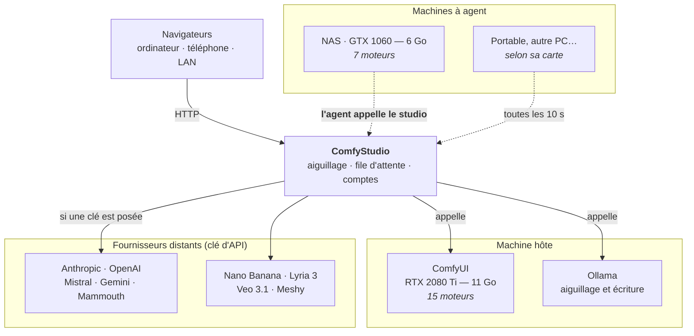

# Plusieurs machines, de puissances différentes

Le studio n'est pas lié à une carte graphique. Il répartit le travail sur
autant de machines qu'on lui en déclare, **de générations et de tailles
différentes**, et choisit pour chaque demande celle qui sait la faire.



Les flèches ne vont pas toutes dans le même sens, et c'est le point important :
**une machine à agent appelle le studio, jamais l'inverse.** Elle peut donc
vivre derrière une box, sur un réseau qu'on ne maîtrise pas, sans redirection
de port ni adresse fixe. Elle se présente avec un jeton, dit ce qu'elle sait
faire, et vient chercher du travail.

## Qui reçoit quoi

Le studio n'envoie une demande à une machine que si elle peut vraiment
l'exécuter : le modèle est présent sur **son** disque, et sa carte tient le
moteur. La page `/admin` affiche pour chaque machine le nombre de moteurs
réellement exécutables — c'est la seule mesure utile, et une pastille verte à
zéro moteur signifie une machine qui ne recevra jamais rien.

Mesuré sur l'installation de référence :

| Machine | Carte | RAM | Moteurs exécutables |
|---|---|---|---|
| hôte | RTX 2080 Ti, 11 Go | 64 Go | 15 |
| NAS ZimaOS | GTX 1060, 6 Go | 23 Go | 7 |

**Le débordement sur la RAM est autorisé**, comme le fait ComfyUI lui-même :
une carte de 6 Go peut charger un modèle de 7 Go si la mémoire système suit —
le rendu ralentit mais aboutit. La tolérance dépend de la RAM (5 Go au-delà de
64 Go de RAM, 3,5 au-delà de 32, 2 au-delà de 16, aucune en dessous). Une
machine où le moteur tient **vraiment** passe toujours devant ; le débordement
est un recours, et il est annoncé dans le journal.

Sans cette règle, le studio refusait d'employer des modèles que l'installeur
avait justement téléchargés pour cette machine : trente-deux gigaoctets dormant
sur le NAS pour un seul moteur utilisable.

## Choisir la machine soi-même

Entre deux machines capables, le studio prend **la plus grosse carte**. C'est le
bon défaut, et c'est le mauvais quand une de ces machines sert à autre chose —
jouer, par exemple. Le sélecteur **« machine »**, dans les réglages sous la zone
de saisie, impose la machine pour les demandes suivantes :

```
machine : automatique
cette machine            — 0 Go   (ne répond pas)
NAS ZimaOS (GTX 1060)    — 5,9 Go
PC (RTX 2080 Ti)         — 11 Go
```

La mémoire de chaque carte est affichée parce que c'est sur elle que le choix
automatique se fait : la voir explique le choix au lieu de le laisser paraître
arbitraire. Une machine qui ne répond pas reste dans la liste, marquée — la
cacher ferait disparaître un choix déjà fait, sans explication, parce qu'un
agent s'est tu trois minutes.

Le choix est retenu **dans le navigateur**, par identifiant de machine et non
par rang dans la liste, les machines allant et venant. « Épargne ma carte, je
joue » vaut pour la soirée, pas pour une demande.

Il reste soumis à la règle du dessus : une machine choisie qui n'a pas le modèle,
ou dont la carte ne tient pas le moteur, ne recevra rien.

## Une machine à agent reçoit aussi les fichiers

Les moteurs qui partent d'une image — agrandir, détourer, fluidifier, sculpter
— ont besoin du fichier sur la machine qui calcule. Comme celle-ci n'a pas
d'adresse joignable, **le fichier voyage avec le travail** : le studio le joint
à la demande, l'agent le dépose dans l'`input` de son propre ComfyUI, et
corrige le graphe si ComfyUI le renomme à la réception.

## Attention à la génération de la carte

Mesuré le 29 août 2026 : la roue PyTorch `cu128` ne contient que `sm_75` et
au-delà. Une **GTX 10xx** (Pascal, `sm_61`) rend alors *« no kernel image is
available for execution on the device »* à la première génération — la carte
est vue, ComfyUI démarre, et rien ne fonctionne. Il faut la roue `cu126`, qui
embarque `sm_50` à `sm_90`.

Le studio distingue ce cas d'une simple panne : une machine incapable est
écartée **définitivement** pour ce travail et la demande repart ailleurs, au
lieu d'attendre trente minutes une machine qui ne pourra jamais.

## Déclarer les machines


Le studio peut piloter plusieurs ComfyUI, sur des machines de puissances
différentes. Copie `noeuds.exemple.json` en `noeuds.json` :

```json
[
  {"id": "local",   "titre": "cette machine",          "url": "http://127.0.0.1:8188"},
  {"id": "atelier", "titre": "PC du salon (RTX 4090)", "url": "http://192.0.2.42:8188"}
]
```

Sans ce fichier, il n'y a qu'une machine et rien ne change.

**Le premier nœud doit garder l'identifiant `local`** : c'est lui qui reçoit les
images produites avant le multi-machines, qui n'ont pas de nom de machine
enregistré. Le renommer les rendrait illisibles.

## Ce qui passe par le réseau, et ce qui ne peut pas

Tout se fait par l'API HTTP de ComfyUI : connaître les modèles présents, pousser
une image d'entrée, relire une sortie. **Deux choses restent impossibles à
distance** : installer un modèle et démarrer le moteur. Une machine à laquelle
il manque un modèle est simplement déclarée incapable de ce travail — le studio
n'écrit que sur son propre disque, et ne télécharge donc que pour lui-même.

## Trois pièges, et comment ils sont traités

**Les GGUF vivent dans un dossier fantôme.** Un `.gguf` posé dans
`models/diffusion_models` n'apparaît jamais dans `/models/diffusion_models` : le
nœud ComfyUI-GGUF enregistre un dossier virtuel `unet_gguf` qui pointe sur le
même répertoire, filtré par extension. Sans correspondance, klein 9B, FLUX.1 et
les deux Wan seraient déclarés absents et retéléchargés — plusieurs dizaines de
gigaoctets pour rien. Vérifié : HTTP et disque s'accordent sur les 12 entrées du
catalogue.

**Le compteur de fichiers est propre à chaque machine.** ComfyUI numérote
`_00001_`, `_00002_`… en repartant de zéro sur chacune. Deux machines produisant
une image le même jour donneraient le même nom, et le relais servirait
silencieusement la mauvaise image — sans erreur, sans trace. L'identifiant de la
machine entre donc dans le nom dès qu'il y en a plus d'une, et chaque fichier
enregistré porte le nom de celle qui l'a produit.

**La VRAM n'est pas une valeur unique.** Le catalogue proposé au modèle de
langage se cale désormais sur la **plus grosse carte joignable**, sans quoi la
machine puissante ne servirait jamais à ce qu'elle sait faire — en silence, sans
la moindre erreur.

## Ce qui n'est pas encore fait

Un seul travail à la fois, sur la machine locale de préférence. La répartition
réelle — plusieurs travaux en parallèle, arbitrage vitesse/qualité d'après le
débit mesuré de chaque carte — attend une seconde machine pour être réglée
honnêtement. ComfyUI expose le temps GPU net (`execution_start_time` /
`execution_end_time`), distinct de l'attente en file : c'est là-dessus que la
mesure se fera, pour ne pas confondre « machine lente » et « machine occupée ».

## Trois défauts qu'on ne voyait pas

Le compte de moteurs par machine, ajouté pour cette raison, a mis au jour trois
pannes silencieuses — toutes corrigées :

1. **L'inventaire n'était jamais réclamé.** L'agent envoie sa liste de modèles
   toutes les cinq minutes ; après un redémarrage du studio, une machine bien
   équipée restait déclarée vide pendant tout ce temps. La réponse au battement
   de cœur porte désormais une demande explicite.
2. **Un inventaire vide était pris pour un inventaire.** Pendant que ComfyUI se
   relève, il répond « 200 » avec des dossiers vides. La garde ne rejetait
   qu'un dictionnaire vide, pas un dictionnaire de listes *vides* : redémarrer
   ComfyUI sur une machine lui faisait perdre tous ses moteurs.
3. **Trois dossiers manquaient** à l'inventaire de l'agent — ceux des moteurs
   ajoutés depuis qu'il a été écrit. Une machine distante ne pouvait donc jamais
   servir l'agrandissement, le détourage ni la fluidité vidéo.

Vérifié de bout en bout : détourage exécuté sur le NAS en 30 s, fichier de
1,4 Mo transmis, résultat rapatrié et conforme.
